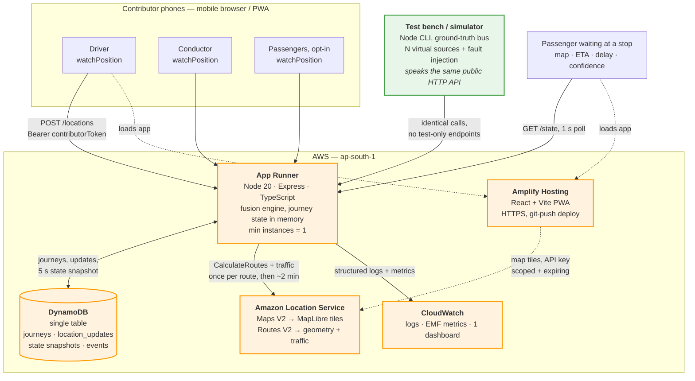
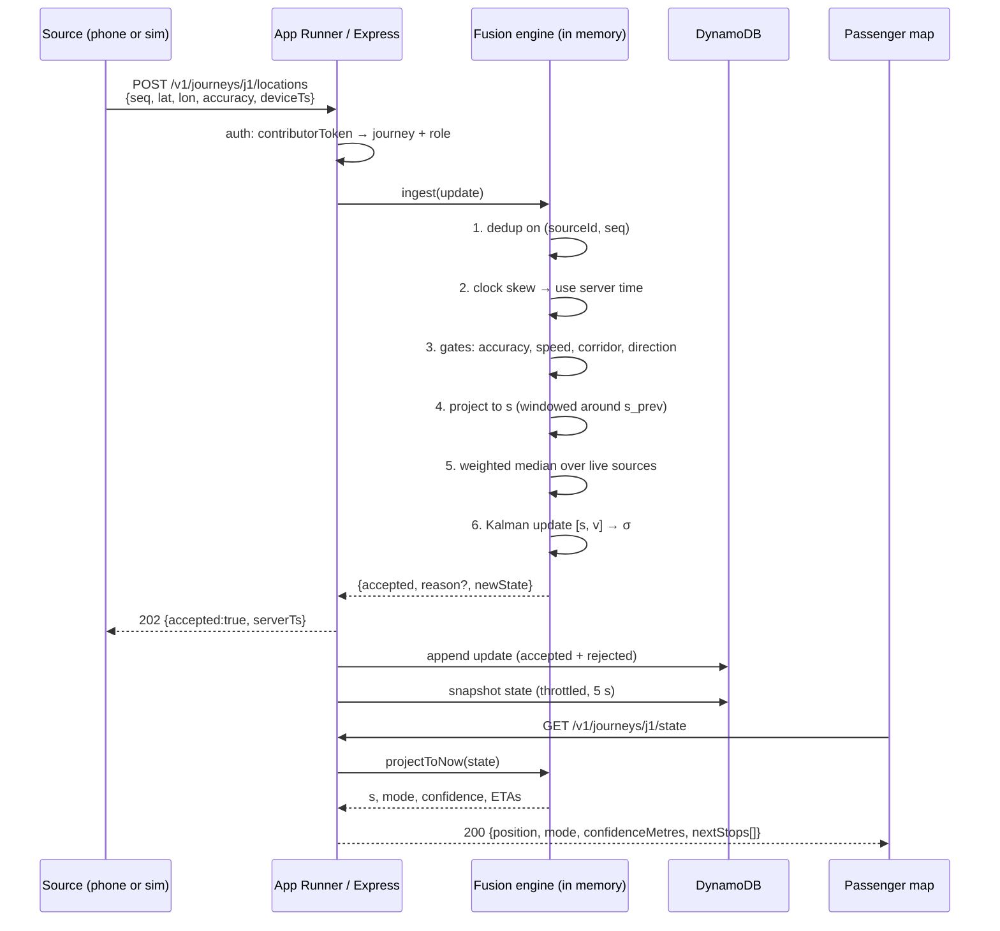
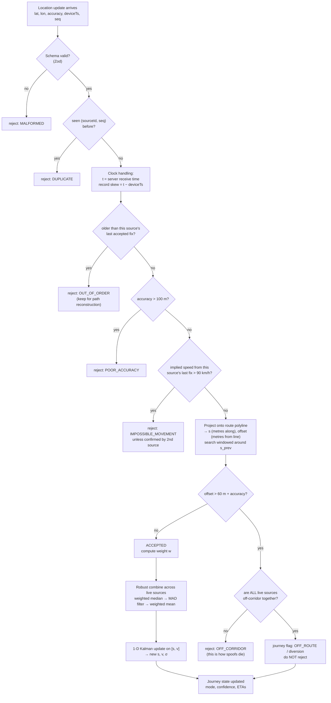
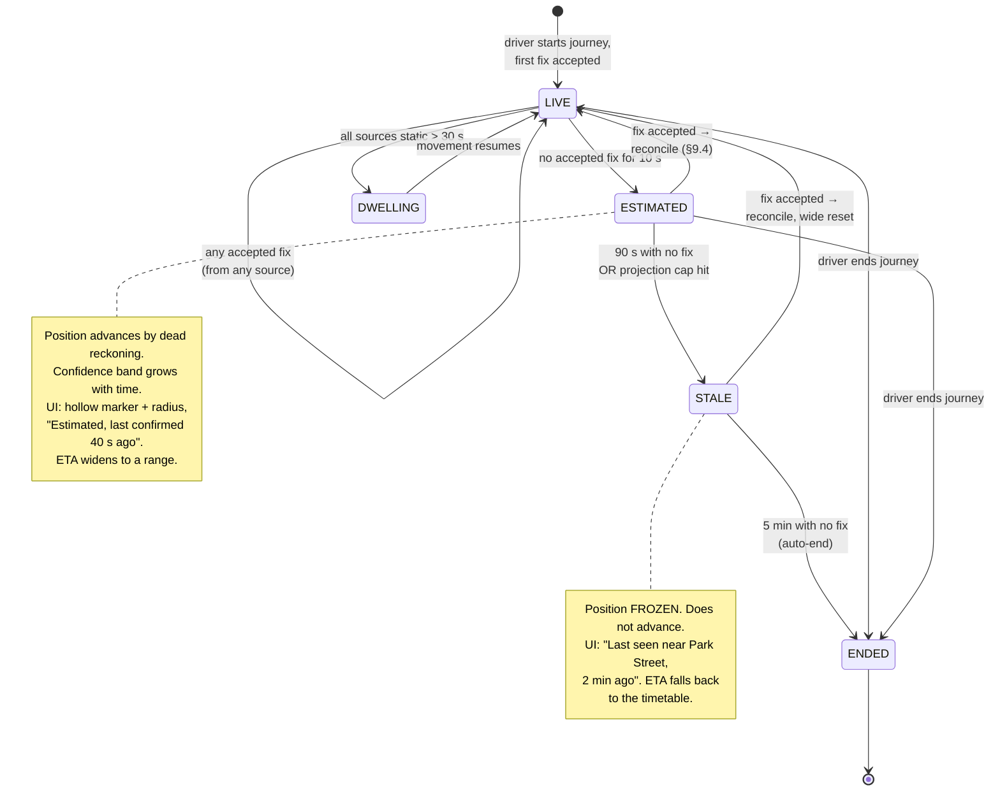
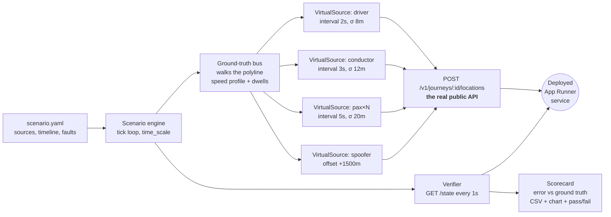
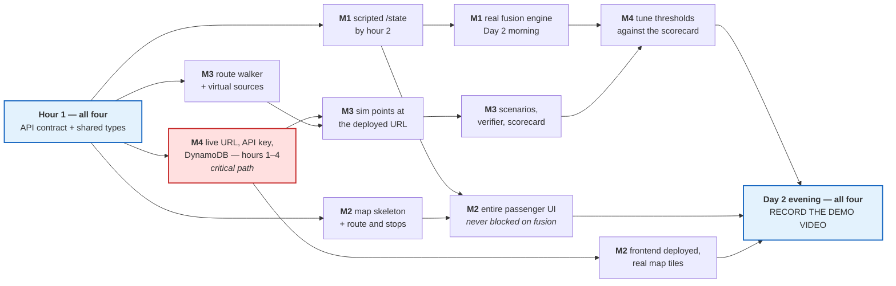

# Community-Powered Transport Information Layer — 3-Day Implementation Plan

**Target event:** WeMakeDevs × AWS *Bharat Builds Tour*, Event 01 — **First Commit**, 17–20 Sept 2026
**Track we are targeting:** **Ship It** (deployed on AWS, live URL, architecture is scored)
**Team size:** 4
**Working window assumed by this plan:** Friday 18 Sept → Sunday 20 Sept

---

## Contents

- [0. Read this first: five things that change the plan](#0-read-this-first-five-things-that-change-the-plan)
- [1. Project understanding](#1-project-understanding)
- [2. MVP definition (the vertical slice we commit to)](#2-mvp-definition-the-vertical-slice-we-commit-to)
- [3. Assumptions](#3-assumptions)
- [4. Where I disagree with the brief](#4-where-i-disagree-with-the-brief)
- [5. Independent architecture recommendation](#5-independent-architecture-recommendation)
- [6. Technology decisions](#6-technology-decisions)
- [7. AWS services: justification, risk and fallback](#7-aws-services-justification-risk-and-fallback)
- [8. Location-source fusion](#8-location-source-fusion)
- [9. GPS outage, prediction and reconciliation](#9-gps-outage-prediction-and-reconciliation)
- [10. ETA calculation](#10-eta-calculation)
- [11. Data model](#11-data-model)
- [12. API contract](#12-api-contract)
- [13. Backend implementation](#13-backend-implementation)
- [14. Frontend implementation](#14-frontend-implementation)
- [15. Test bench / simulator design](#15-test-bench-simulator-design)
- [16. Member responsibilities](#16-member-responsibilities)
- [17. Day-by-day plan](#17-day-by-day-plan)
- [18. Edge cases and feasibility](#18-edge-cases-and-feasibility)
- [19. Security and privacy](#19-security-and-privacy)
- [20. Testing checklist](#20-testing-checklist)
- [21. Demo and video](#21-demo-and-video)
- [22. What not to build](#22-what-not-to-build)
- [23. Stretch goals, strictly in this order](#23-stretch-goals-strictly-in-this-order)
- [24. Failure and backup plan](#24-failure-and-backup-plan)
- [25. Definition of done](#25-definition-of-done)
- [26. Sources](#26-sources)

---

## 0. Read this first: five things that change the plan

These come from the hackathon's own pages, not from the project brief. They materially change what we should build.

1. **There is no live demo. Judges score the submission only.** The rules say plainly that judges score what you submit and nothing else, that there is no live demo and no call, and that a feature which only exists in the writeup does not count. Everything we build has to be legible inside **a three-minute YouTube video**. A feature the video cannot show is worth close to zero.
2. **The demo video must visibly show AWS.** Naming AWS in the writeup is explicitly not enough. So the video needs actual AWS console/URL frames, not just a working app.
3. **The submission is three artifacts:** a public repo, a video under three minutes, and a short writeup covering problem / build / where AWS fits.
4. **"Learning" is a scored criterion in its own right,** and there is a separate prize for the top 5 blog posts published on AWS Builder Center. Writing up what we learned is not admin overhead — it is scored work.
5. **The clock started Thursday 17 Sept and commit history must match the event dates.** We have lost Thursday. Create the repo today and commit normally; do not backdate anything. Old or pre-started projects are disqualified.

**Scheduling consequence:** the exact Sunday deadline hour was still listed as "being finalised" at the time of writing. **Treat Saturday 23:00 as the real deadline.** Everything after that is buffer. Check the event page for the published hour as soon as it appears.

**The one-line answer to "what do the four of us build?"**
A single deployed Node/TypeScript service on AWS App Runner that takes location reports from several phones on one bus journey, fuses them into one position **in one dimension along the route**, keeps estimating position for up to 90 seconds when every GPS source drops, reconciles honestly when GPS returns, and serves a passenger map on Amplify Hosting using Amazon Location maps — driven end to end by a simulator that speaks the same HTTP API a real phone does.

---

## 1. Project understanding

The problem is real and well-chosen: a timetable is a statement of intent, and passengers need a statement of fact. The interesting part of the idea is not bus tracking — it is that **the tracking hardware is already on the bus, in people's pockets**, and that the system should treat the *journey* as the tracked entity rather than any individual phone.

That reframing is what makes this a framework and not another tracker app, and it is what produces the two genuinely hard technical problems:

| Hard problem | Why it is hard | Where it is solved in this plan |
|---|---|---|
| N phones, one bus | Twenty reporters must produce one position, not twenty buses, and they disagree | §8 Fusion |
| Sources are voluntary and unreliable | They join, leave, lose signal, lie, and their clocks are wrong | §8, §9, §18 |
| Nobody should care which phone is reporting | The passenger abstraction must survive the source layer churning underneath it | §9 state machine, §14.2 UI honesty rules |

Everything else in the brief (WhatsApp, SMS, APIs, multiple cities) is interface surface over the same core. Correct instinct, and correctly deferred.

### What we are deliberately treating as the product

The passenger at the stop asks four questions: *where is it, how far, when will it arrive, has it passed me already.* The system's job is to answer those four with an honest confidence attached. **"Honest confidence" is the differentiator** — most hackathon tracking demos show a confident dot that is silently wrong. Ours will say when it is guessing, and that is both better engineering and a better 20 seconds of video.

---

## 2. MVP definition (the vertical slice we commit to)

One route. One journey at a time as the demo path, with multiple journeys supported by the data model. Everything below is in scope.

**In scope — must work by Saturday night**

- One real route, hand-picked, with road-following geometry and 6–10 stops.
- Driver starts a journey; conductor joins; passengers opt in — all from a phone browser.
- Multiple simultaneous location sources posting to one journey.
- Fusion to a single position with outlier rejection and per-source trust weighting.
- GPS dropout: continue estimating for a bounded period, degrade confidence visibly, freeze rather than drift, reconcile on return.
- Deterministic ETA to the next few stops, published as a range.
- Passenger map: bus position, route line, stops, ETA, delay, journey state, confidence.
- An ops/debug view that makes the fusion visible (this is for the video as much as for us).
- Simulator that drives all of the above through the real public API.
- Deployed on AWS with a public HTTPS URL.

**Explicitly out of scope** — see §22 for the full list. Headlines: no accounts, no login, no multi-city, no WhatsApp/SMS, no ML, no offline-first sync, no admin CRUD, no Kubernetes.

**Demo-critical definition of "working":** the simulator runs a 7-minute scenario against the deployed service, and at the end prints measured numbers — mean position error while live, worst-case error during the blackout, seconds to recover after reconnection, and whether the spoofed source was rejected. Numbers in a README beat adjectives in a pitch.

---

## 3. Assumptions

Stated so they can be challenged rather than discovered on Sunday.

1. Four people, each with a laptop, and at least two Android phones plus one iPhone for real-device testing.
2. One AWS account for the team, claiming the $100 hackathon credits plus new-account free-tier credits. **One account, not four** — fragmenting across accounts is how teams lose an afternoon.
3. Region **ap-south-1 (Mumbai)**. Amazon Location's current Places/Routes/Maps APIs are available there, and it is the lowest latency for us.
4. All four can read and write TypeScript. Only one needs to be strong at the geometry/filter maths.
5. Nobody has to ride a bus for the demo to work. Real-phone testing is a *validation* step, not the demo path.
6. The route we pick does not overlap itself and we treat each direction as its own route. (If your route has a common trunk or a loop, read the warning in §8.2 — it breaks the naive version of the fusion approach.)
7. We have working internet and a phone hotspot as backup.

---

## 4. Where I disagree with the brief

Asked for independent judgement, so here it is. Five places where the brief's framing should change.

### 4.1 "Real-time" does not mean WebSockets here — and on our chosen compute it cannot.

AWS App Runner, which the hackathon itself advertises as the fast way to get a URL, **does not support inbound WebSockets** (the feature request has been open on the App Runner roadmap since 2021), and it enforces a 120-second total request timeout, which also rules out long-lived Server-Sent Events without reconnection logic. That is not a reason to abandon App Runner. It is a reason to notice that **smooth motion on the map is a client-side rendering problem, not a transport problem.** One-second HTTP polling plus client-side interpolation along the route line looks identical to a WebSocket feed and costs us about 40 lines of code instead of half a day. Socket.IO is cut. Details in §6.1 and §14.3.

### 4.2 Do not fuse latitude and longitude. Fuse distance along the route.

This is the most important technical recommendation in this document. A bus on a known route has essentially **one** degree of freedom: how far along the polyline it is. Averaging lat/lon is not just imprecise, it is wrong in a way that shows on screen — the average of two points on a curve lands off the road, in a building or in a river. Convert every incoming fix to a scalar `s` (metres travelled along the route), fuse in that 1-D space, and convert back to lat/lon for rendering. The marker is then *always* on the road, outlier detection becomes trivial 1-D statistics, prediction becomes `s += v·Δt`, and distance-to-stop is a subtraction. The brief listed "route matching" as one consideration among twelve; it is actually the foundation that makes the other eleven easy.

### 4.3 Do not call a routing API to do route matching.

Amazon Location's `SnapToRoads` is real and useful, but it is a **batch trace-matching API** (up to 200 trace points in its Advanced tier), not a per-point service. Putting it in the hot path would add network latency and cost to every single location update for something that is ~20 lines of local vector maths. Precompute the route polyline once, and project points onto it in-process, sub-millisecond. Use `SnapToRoads` where it actually earns its place: offline, to clean a recorded trace, and post-journey to draw the actual path travelled. See §6.3.

### 4.4 An authentication system is not needed, and building one would be actively worse for the privacy story.

No accounts, no Cognito, no phone verification. Use **capability tokens scoped to a single journey**: starting a journey returns an opaque driver token and a short human-readable join code; joining returns a contributor token. The token *is* the authorisation. A contributor is a random ID with a role and nothing else — no name, no number, no persistent identity. This is less work than Cognito *and* it is a stronger answer to "are you tracking people?" than any login screen would be. Security and privacy are covered in §19.

### 4.5 No ML, and no Bedrock.

The brief was right to be suspicious. For ETA over a fixed route with a known polyline, a deterministic model (remaining road distance ÷ blended speed estimate + dwell allowance) is not a compromise — it is the correct engineering answer, and it is debuggable at 2am. There is no training data, three days is not enough to generate any, and a model would be strictly worse than arithmetic. Bedrock would add an AWS service that improves nothing in the core loop; judges score whether it works, and "Built on AWS" is satisfied several times over by compute, data, maps and routing. §10.3 covers where ML would genuinely help in a production version.

---

## 5. Independent architecture recommendation

One stateful service, one thin database, managed static hosting, managed maps. Four AWS services doing real work, plus logging.

### 5.1 Why a single stateful container rather than Lambda

This is the main architectural fork, so here is the reasoning rather than a verdict.

The fusion engine is **stateful by nature**: it holds per-journey filter state, per-source trust and clock skew, and a recent trajectory window. There are two ways to run it.

| | App Runner (one container, state in memory) | Lambda + API Gateway (state in DynamoDB) |
|---|---|---|
| Fusion state access | In-process. Node's single-threaded event loop serialises updates **for free** — no locks, no races | Read-modify-write DynamoDB per update; concurrent sources on one journey contend on one item |
| Concurrency correctness | Naturally safe | Needs conditional writes + optimistic retry. Real bug source under demo load |
| Prediction ticker | Not needed (see §5.2) | Not needed (see §5.2) |
| Local dev | `npm run dev`, identical to prod | SAM local, or deploy-to-test loops |
| Time to first live URL | ~15 min | ~30–45 min |
| Cold start | None with min instances = 1 | Visible on first poll |
| Team's existing skills | Express/TS/Docker — direct hit | New ground for most of them |
| Failure mode | Instance replacement loses in-memory state | Stateless, survives anything |

App Runner wins on every axis that matters in 72 hours. The one real weakness — losing in-memory state if the instance is replaced — is handled by snapshotting journey state to DynamoDB every 5 seconds and rehydrating on boot. That is 20 lines, and it also gives us the persistence story judges will ask about.

**Decision: App Runner.** Lambda is not wrong, it is just more expensive in hours for the same demo.

### 5.2 The insight that removes a whole component

Dead reckoning during a GPS outage sounds like it needs a background ticker advancing every bus every second. It does not. **Make the projection a pure function evaluated at read time.**

```
positionNow(journey) = project(lastFusedState, now − lastFusedState.t)
```

The stored state is the last *fused* estimate; the current position is computed when someone asks. No scheduler, no EventBridge rule, no Step Functions, no 1-second server loop. The same pure function runs on the client between polls, which is what produces smooth motion. This one decision removes a background-job service from the architecture and removes an entire class of "why is the bus still moving" bugs.

### 5.3 Architecture diagram



### 5.4 Request flow for one location update



Note that **rejected updates are stored too.** That is not bookkeeping — it is how the ops view proves the spoofed source was caught, which is 15 seconds of the video.

---

## 6. Technology decisions

### 6.1 Verdict table

Every technology named in the brief, plus the ones I am adding. Verdicts are **Use / Optional / Do not use / Replace**.

| Technology | Verdict | Reasoning |
|---|---|---|
| **Node.js 20 + TypeScript** | **Use** | Team knows it. One language across backend, simulator and frontend means shared types for the API contract — a real velocity win over three days. Types on the fusion module catch unit-confusion bugs (metres vs degrees) that would otherwise eat an evening. |
| **Express** | **Use** | Nine endpoints. Nothing here needs Nest or Fastify. |
| **PostgreSQL / RDS** | **Do not use** | Two independent killers. (1) Provisioning plus VPC plus security groups is 20–40 minutes of nobody's time well spent. (2) Attaching App Runner to a VPC to reach RDS **removes the service's default outbound internet access**, which would break our Amazon Location calls unless we also add a NAT Gateway. That is a genuine trap, it costs money, and it would be discovered at the worst possible time. Relational modelling buys us nothing at this scale. |
| **MongoDB / Atlas** | **Do not use** | Adds a non-AWS network dependency and an external account, weakens the "Built on AWS" story, and does nothing DynamoDB does not do here. |
| **DynamoDB** | **Use — kept deliberately thin** | One table, on-demand capacity, no VPC, no instance, ~15 minutes including IAM. Six access patterns, listed in §11.2. Also gives us a console screen to show in the video. **Do not turn this into a data-modelling exercise.** |
| **Redis / ElastiCache** | **Do not use** | Redis exists to give multiple processes shared hot state. We have one process, so a plain `Map` in memory *is* our Redis, with zero setup and zero network hop. Adding ElastiCache means a VPC, which triggers the App Runner NAT problem above. |
| **Socket.IO** | **Do not use** | App Runner does not support inbound WebSockets. Also the traffic is almost entirely one-directional and low-value-per-message; Socket.IO's reconnection and room machinery solves problems we do not have. |
| **Native WebSocket** | **Do not use on this stack** | Same blocker. Only reachable by moving to ECS + ALB, which is 2+ hours we should spend on fusion quality. |
| **API Gateway WebSocket API** | **Do not use** | A connection-ID table, `$connect`/`$disconnect`/`$default` routes, and a Lambda to fan out. Half a day minimum, and the passenger map looks *identical* to the 1-second-polling version. Zero demo value for real cost. |
| **HTTP polling, 1 s, + client-side interpolation** | **Use** | The chosen answer. Cheap, debuggable with `curl`, works through every proxy and captive portal, and survives the phone sleeping (it just resumes). Smoothness comes from the client tweening along the polyline, not from packet frequency. |
| **Server-Sent Events** | **Do not use** | App Runner's 120-second request cap forces reconnect logic, at which point it is strictly worse than polling. |
| **Docker** | **Optional** | App Runner can build a Node service straight from the repo, which skips images and ECR entirely. Start there. Add a Dockerfile only if the managed build fights you — then it is a 6-line file and a push to ECR. |
| **Kubernetes / EKS / ECS** | **Do not use** | Nothing to gain, a cluster to debug. EKS in particular would consume the entire weekend. |
| **EC2** | **Fallback only** | The blocker is not compute, it is TLS. **`navigator.geolocation` requires a secure context** — on a bare EC2 public IP over HTTP, phones will refuse to give us GPS at all, and the whole project stops. Getting a real certificate onto EC2 means a domain plus ALB plus ACM, which is more work than App Runner, which hands us HTTPS for free. Keep EC2 as the documented escape hatch (§24), not the plan. |
| **AWS Lambda** | **Do not use for the fusion path** | Reasoned in §5.1. Fine for a one-off route-geometry generation script, but even that is easier as a local script. |
| **App Runner** | **Use** | HTTPS URL in ~15 minutes, deploy from source or container, keeps in-memory state, scales without us thinking about it, and is named in the Ship It track description. Set **min instances = 1** so state is not lost and there is no cold start on camera. |
| **Amplify Hosting** | **Use** | Static React build, git-push deploy, HTTPS, custom headers. ~10 minutes. |
| **S3 + CloudFront** | **Optional** | Identical end result, but more moving parts (bucket policy or OAC, distribution, cache invalidation on every deploy). Choose it only if Amplify's build misbehaves. |
| **Cognito** | **Do not use** | §4.4. Capability tokens are less work and a better privacy answer. |
| **Amazon Location — Maps V2** | **Use** | §6.2. |
| **Amazon Location — Routes V2** | **Use, narrowly** | §6.3. |
| **Amazon Location — Places V2** | **Do not use** | No address search or geocoding in the MVP. Stops are authored by hand. |
| **Amazon Location — Trackers & Geofences** | **Do not use** | Tempting and wrong. A Tracker stores positions **per device** and does not fuse them, which is precisely the problem we are solving — it would give us twenty tracked devices, not one bus. Geofences could answer "has it passed a stop", but that needs a geofence collection plus EventBridge wiring for a question our 1-D `s` value answers with a `>` comparison. |
| **Amazon Bedrock** | **Do not use (stretch only)** | §4.5. |
| **EventBridge / Step Functions** | **Do not use** | The read-time projection in §5.2 removes the need for any scheduler. |
| **CloudWatch Logs + EMF custom metrics + one dashboard** | **Use** | Structured logs are how we debug on Saturday night, and the dashboard is a genuinely good 10 seconds of video showing source count and confidence over time. |
| **Prometheus + Grafana** | **Do not use** | Hours of setup (or Amazon Managed Grafana + workspace + data source) to produce graphs CloudWatch already gives us. Classic "impressive architecture diagram, no working feature" trade. Mention it in the writeup as the production path. |
| **MapLibre GL JS** | **Use** | §6.2. |
| **Vite + React** | **Use** | Fast builds, trivial Amplify integration. |
| **Turf.js** | **Optional, probably skip** | Tempting for geometry, but we need exactly three functions (haversine, point-to-segment projection, interpolate-along-line) and writing them ourselves is ~60 lines, has no bundle cost, and means we understand our own numbers. Use it if the maths is fighting you. |
| **Zod** | **Use** | Validating inbound location payloads at the edge is a five-minute investment that kills a whole edge-case category (§18: malformed, missing fields, string-vs-number). |

### 6.2 Map stack

**Recommendation: Amazon Location Service Maps V2 as the tile source, rendered by MapLibre GL JS, authenticated with a scoped API key.**

This is the rare case where the AWS-native option is also the technically best one, so there is no tension with the hackathon context:

- **The current Maps V2 API needs no resource creation.** Older Amazon Location required creating a map resource and choosing a data provider; V2 uses standalone endpoints and a fixed style name. That removes a setup step.
- The style URL is a single string, and MapLibre consumes it directly:

```js
// Styles available: Standard | Monochrome | Hybrid | Satellite
// color-scheme: Light | Dark
const styleUrl =
  `https://maps.geo.${region}.amazonaws.com/v2/styles/Standard/descriptor?key=${apiKey}`;

const map = new maplibregl.Map({
  container: 'map',
  style: styleUrl,
  center: [lon, lat],
  zoom: 13,
});
```

- **ap-south-1 is supported** for API-key authenticated map access.
- MapLibre is open source, has no token-per-load billing surprises, and renders vector tiles smoothly on mid-range Android — which matters, because that is what our users have.

**Why not the alternatives**

| Option | Why not |
|---|---|
| Google Maps JS API | Needs a billing-enabled Google Cloud project and a card; weakens the AWS story for zero technical gain; per-load pricing. |
| Leaflet + raster OSM tiles | Leaflet is fine, but raster tiles look dated and, more practically, the public OSM tile server's usage policy is not appropriate for an app. We would need a tile provider anyway. |
| MapLibre + Protomaps/MapTiler | Perfectly good, but it is one more third-party account and it throws away the free AWS alignment. |
| Mapbox GL JS | Licence change is why MapLibre exists; needs a token. |

**How each map requirement is met**

| Requirement | Implementation | Cost per journey |
|---|---|---|
| Display route | GeoJSON `LineString` from our own route file → MapLibre `line` layer | Zero (our data) |
| Display stops | GeoJSON `Point` collection → `circle` + `symbol` layers | Zero |
| Moving bus marker | One `Marker`, position set from the poll response, tweened with `requestAnimationFrame` | Zero |
| Route matching | **Local** point-to-polyline projection in the backend (§8.2) | Zero |
| Road-following route geometry | `CalculateRoutes` **once**, cached to a committed JSON file | 1 call, ever |
| Traffic-aware ETA | `CalculateRoutes` with traffic every ~2 min per active journey | ~30 calls/hour |
| Tiles | Maps V2 `GetTile` via MapLibre | ~80–150 tiles per fresh map load |

**Cost and free-tier notes.** Amazon Location has a monthly free-tier allowance for new accounts (three months of free tier, and new accounts since mid-2025 receive up to $200 in AWS Free Tier credits), plus the hackathon's $100 team credits. Our whole weekend, including a few hundred demo runs, will not come close. The two things that *could* surprise us: **map tile volume** (the Hybrid style overlays a raster and a vector tile, so it counts roughly double — use `Standard`), and leaving a browser tab reloading maps overnight. Set a **budget alert at $5** on day one; it takes two minutes and turns a possible disaster into a notification.

### 6.3 Where Routes V2 genuinely earns its place

Documented capability: the Routes API calculates routes and estimates travel time using current road-network and live traffic data, with operations `CalculateRoutes`, `CalculateRouteMatrix`, `OptimizeWaypoints`, `CalculateIsolines`, and `SnapToRoads` for map-matching GPS traces.

Three uses, in order of value:

1. **Generate the route polyline (highest value, one call, do it first).** Feed the stop coordinates in as ordered waypoints; get back a road-following geometry with leg distances and durations. Save the result as `routes/route-24.json` and commit it. The alternative — hand-drawing a polyline through a map editor — is an hour of tedium and produces geometry that does not follow the road, which makes every subsequent projection worse. **This single call is what makes the 1-D fusion approach viable.**
2. **Traffic-aware segment durations (every ~2 minutes per active journey).** Call `CalculateRoutes` from the current estimated position to the terminus, passing the remaining stops as waypoints and enabling traffic, and use the returned per-leg durations as the travel-time profile for the ETA model. Two minutes of cache is the right granularity — traffic does not change every second, and per-request calling would be both slow and wasteful.
3. **`SnapToRoads`, offline only.** Use it to clean a recorded real-phone trace into a tidy scenario for the simulator, and after a journey ends to render the actual path travelled against the route. **Keep it out of the request path** — it is a batch API (200 trace points in the Advanced pricing tier, 5,000 in Premium) with a network round trip, for a job our local projection does in microseconds.

**What we do not use:** `CalculateRouteMatrix` (no multi-origin problem), `OptimizeWaypoints` (stop order is fixed by the route), `CalculateIsolines` (nothing to do with our question).

---

## 7. AWS services: justification, risk and fallback

Five services. Each one does work that would otherwise have to be built or bought.

### 7.1 AWS App Runner — the API and fusion engine

| | |
|---|---|
| **What we use it for** | Hosts the single Node/Express/TypeScript service: journey lifecycle, location ingestion, fusion engine, state projection, ETA, ops endpoints. |
| **Who calls it** | Contributor phones (`POST /locations`), the simulator (same endpoints), the passenger frontend (`GET /state`, 1 s poll). |
| **Better than the simpler alternative** | The simpler alternative is EC2, which we already know — and it is worse here, because browser geolocation requires HTTPS and App Runner gives us a valid certificate immediately while EC2 needs a domain, ALB and ACM. Compared with Lambda, it keeps fusion state in memory, which removes DynamoDB write contention and a class of concurrency bugs (§5.1). |
| **Realistic configuration time** | 15–20 min for a hello-world deploy from a GitHub repo. 5 min per redeploy after that. |
| **What could go wrong** | (1) Source-based build fails on a native dependency or an unusual `package.json` — switch to a Dockerfile. (2) Health check fails and the deploy rolls back — make sure `GET /health` returns 200 with no dependencies on DynamoDB or Location. (3) Instance replacement drops in-memory state mid-demo — mitigated by the 5 s DynamoDB snapshot and rehydrate-on-boot. (4) Scale-to-zero or CPU throttling when idle — set **min instances = 1**. (5) Forgetting that a deploy takes 3–5 min, so do not push at minute 90 of the demo recording. |
| **Fallback** | `docker compose up` on a laptop, exposed through an `ngrok`/Cloudflare tunnel for HTTPS. Keep this tested — it is our insurance against an AWS problem on Sunday, and it takes 10 minutes to verify once. |

### 7.2 Amazon DynamoDB — journeys, update log, snapshots

| | |
|---|---|
| **What we use it for** | Durable journey records, the append-only log of location updates (**accepted and rejected, with the reject reason**), periodic journey-state snapshots for crash recovery, and the journey event log. |
| **Who calls it** | Only the App Runner service. Nothing else touches it. |
| **Better than the simpler alternative** | The simpler alternative is memory only, which would actually run the demo — but then a redeploy wipes a live journey, and there is nothing to show as persistence. Compared with RDS/Postgres, DynamoDB needs no VPC (which would break App Runner's outbound internet without a NAT Gateway), no instance, no schema migration, and is on-demand priced to effectively zero at our volume. |
| **Realistic configuration time** | 15 min including the IAM role for App Runner. One table, on-demand, no GSIs needed if keys are designed as below. |
| **What could go wrong** | (1) IAM role missing the right actions — the single most common time sink; test with the AWS CLI from the container before wiring app code. (2) Writing every update synchronously adds latency — **fire-and-forget the writes** (queue in memory, flush in batches of 25 with `BatchWriteItem`); the fused state must never wait on a database write. (3) Hot partition if every update shares one key — avoided by partitioning on journey ID. (4) Item size limits if we try to store whole trajectories in one item — store updates as separate items. |
| **Fallback** | An in-memory ring buffer plus a JSON dump to disk. The demo does not depend on DynamoDB being up; the app should log a warning and carry on if writes fail. Build it that way from the start. |

### 7.3 Amazon Location Service — maps and routing

| | |
|---|---|
| **What we use it for** | Maps V2 vector tiles for the passenger and ops views (via MapLibre, API key). Routes V2 `CalculateRoutes` to generate route geometry once and to refresh traffic-aware segment durations every ~2 min. `SnapToRoads` offline for trace cleaning. |
| **Who calls it** | Tiles: the browser directly, with a scoped API key. Routing: the App Runner service only, with its IAM role. |
| **Better than the simpler alternative** | Simpler alternative for geometry is drawing a polyline by hand — an hour of work producing worse data that does not follow roads. Simpler alternative for tiles is a third-party map provider, which means another account, another key, and no AWS alignment. Simpler alternative for traffic is ignoring traffic, which is a defensible MVP choice but gives up a visible ETA improvement for a service that costs us ~30 calls an hour. |
| **Realistic configuration time** | 10 min: create an API key with restrictions, note the region, add IAM permissions for `geo-routes` to the App Runner role. Getting a map on screen is genuinely a 10-minute job with the style URL in §6.2. |
| **What could go wrong** | (1) **Wrong region in the style URL** — symptom is a blank grey map with 403s in the console; check the key's region matches. (2) API key restrictions too tight (`AllowReferers` not matching the Amplify domain) — blank map again. Note that updating a key that has been used in the last 7 days requires `ForceUpdate: true`, which is a confusing failure the first time. (3) Using the `Hybrid` style and burning tile quota at roughly double rate. (4) Assuming `SnapToRoads` is per-point and building it into the hot path — do not. (5) Route geometry quality on small local roads may be imperfect; pick a route on decent roads. |
| **Fallback** | Tiles: swap the style URL for a MapLibre demo/Protomaps style — **one string change**, so keep it in an env var. Routing: the committed `route-24.json` means geometry never needs a live call again, and the ETA model degrades gracefully to distance ÷ blended speed with no traffic term. Neither fallback breaks the demo. |

### 7.4 AWS Amplify Hosting — the frontend

| | |
|---|---|
| **What we use it for** | Builds and serves the React/Vite PWA on HTTPS: passenger view, contributor view, ops view. |
| **Who calls it** | Every browser. |
| **Better than the simpler alternative** | Serving static files from the App Runner container would work and saves a service — but it couples frontend deploys to backend deploys (3–5 min each, and a frontend typo would redeploy the API), and it puts asset traffic through our single instance. Amplify is a git push and ~2 min. Compared with S3 + CloudFront, it is the same outcome with fewer steps and no cache-invalidation ritual. |
| **Realistic configuration time** | 10 min to connect the repo and get the first build green. |
| **What could go wrong** | (1) Build fails because the monorepo root is wrong — set the app root and build output directory explicitly. (2) Env vars (`VITE_API_BASE`, `VITE_LOCATION_API_KEY`, `VITE_AWS_REGION`) not configured in the Amplify console, producing a working build that talks to `localhost`. (3) CORS on the App Runner service not allowing the Amplify origin — configure this on day 1, not day 3. (4) Committing the Location API key into the repo instead of injecting it at build time. |
| **Fallback** | `npm run build` and serve `dist/` from the App Runner container on a `/app` path, or Netlify/Vercel. Frontend hosting is the least risky part of this stack. |

### 7.5 Amazon CloudWatch — logs, metrics, one dashboard

| | |
|---|---|
| **What we use it for** | Structured JSON logs from App Runner (automatic), plus a handful of custom metrics published via embedded metric format: `ActiveSources`, `AcceptedUpdates`, `RejectedUpdates` (by reason), `ConfidenceMetres`, `JourneyMode`, `ReconciliationErrorMetres`. One dashboard with four graphs. |
| **Who calls it** | The App Runner service. |
| **Better than the simpler alternative** | The simpler alternative is `console.log`, which we get anyway. The reason to add metrics is specifically the demo: a graph showing confidence degrading during the blackout and snapping back on reconnection is the clearest possible visual proof that the feature works, and it is 30 lines of code. It also happens to be how we debug Saturday night. |
| **Realistic configuration time** | Logs: zero, App Runner ships them. Metrics: 30 min. Dashboard: 20 min. |
| **What could go wrong** | (1) Over-investing — this is a 1-hour job, not a 4-hour job; if the dashboard is not done by Saturday evening, ship without it. (2) Log volume cost from logging every update at 1 Hz — sample the noisy ones. (3) Metric namespace typos meaning empty graphs on camera; check the dashboard before recording. |
| **Fallback** | The ops view in our own frontend already shows the same information from the API, and the simulator prints the numbers. CloudWatch is a nice-to-have, not load-bearing. |

### 7.6 AWS services we should NOT attempt this weekend

| Service | Why not now |
|---|---|
| **EKS / ECS with ALB** | Cluster, task definitions, target groups, health checks. Half a day for compute we already have. |
| **RDS / Aurora** | VPC + App Runner VPC connector + NAT Gateway to restore outbound internet. Actively dangerous to our Location calls. |
| **ElastiCache** | Same VPC problem, for state we already hold in process. |
| **Cognito User Pools** | Solves a problem we decided not to have. |
| **API Gateway WebSocket API** | Half a day, zero visible difference. |
| **IoT Core** | The genuinely correct production transport for device telemetry at scale, and completely wrong for a weekend — MQTT, certificates, topic rules, device provisioning. **Say this in the writeup** as the production evolution; it shows judgement. |
| **Kinesis / MSK / Firehose** | Our peak is a few dozen messages a second. A stream processor is a solution to a problem we will not have until thousands of buses. |
| **SageMaker** | No data, no time, no benefit. |
| **Step Functions / EventBridge Scheduler** | Removed by the read-time projection design (§5.2). |
| **Amazon Managed Grafana** | Workspace + IAM Identity Center + data sources. CloudWatch dashboards are enough. |
| **Route 53 + ACM custom domain** | The App Runner and Amplify default domains are already HTTPS. A custom domain is pure vanity here and DNS propagation can eat an hour. |
| **WAF, Shield, GuardDuty** | Nothing to protect for 72 hours. |

---

## 8. Location-source fusion

The intellectual core. Build it as a **pure, dependency-free TypeScript module** (`src/fusion/`) with unit tests and no knowledge of Express, DynamoDB or AWS. That constraint is what lets Member 1 develop it against tests while Member 4 tunes thresholds against the simulator, without either blocking the other.

### 8.1 Pipeline



### 8.2 Step 1 — Reduce 2-D to 1-D: projection onto the route

Precompute once at route load: the polyline as an array of points, and a parallel array of cumulative distances.

```ts
// Done once when the route file loads.
type Route = {
  points: [number, number][];   // [lon, lat]
  cum: number[];                // cum[i] = metres from route start to points[i]
  lengthM: number;
  stops: { id: string; name: string; sM: number }[];  // each stop's s along the route
};

/**
 * Project a fix onto the route.
 * `sPrev` constrains the search — see the loop warning below.
 * Returns distance along route (sM) and perpendicular offset (offsetM).
 */
function projectToRoute(route: Route, lon: number, lat: number, sPrev?: number) {
  // Search window: only consider segments plausibly reachable from sPrev.
  // Without this, a route that passes near itself gives a wildly wrong s.
  const window = sPrev === undefined
    ? [0, route.lengthM]
    : [sPrev - 200, sPrev + 600];   // bus can't go far backward, some forward

  let best = { sM: sPrev ?? 0, offsetM: Infinity };

  for (let i = 0; i < route.points.length - 1; i++) {
    if (route.cum[i + 1] < window[0] || route.cum[i] > window[1]) continue;
    const { t, distM } = pointToSegment([lon, lat], route.points[i], route.points[i + 1]);
    if (distM < best.offsetM) {
      const segLen = route.cum[i + 1] - route.cum[i];
      best = { sM: route.cum[i] + t * segLen, offsetM: distM };
    }
  }
  return best;
}
```

> **Warning — read this before picking a route.** If the route touches or parallels itself (a loop, a figure-eight, or a shared trunk used in both directions), a single lat/lon maps to **two or more** valid values of `s`, and unwindowed projection will teleport the bus. Two mitigations, use both: (1) always pass `sPrev` and constrain the search window, as above; (2) **treat each direction as a separate route** with its own polyline and its own journeys. Choose a demo route without self-overlap and this problem stays theoretical.

Rendering is the inverse — interpolate along the polyline to get lat/lon from `s`. This is why the marker is **always exactly on the road**, which is most of why the demo looks credible.

### 8.3 Step 2 — Weighting each source

```
w_i = w_freshness · w_accuracy · w_trust · w_corridor
```

| Factor | Formula | Reasoning |
|---|---|---|
| Freshness | `exp(-Δt / 10)` | A 3-second-old fix is worth 0.74; a 30-second-old fix is worth 0.05. Old data should fade, not cliff-edge. |
| Accuracy | `1 / (max(acc, 5)² )`, normalised | Inverse-variance weighting is the statistically correct way to combine measurements of differing precision. Floor at 5 m because some browsers report implausibly good accuracy. |
| Trust | driver 1.0 · conductor 0.9 · passenger 0.6 · passenger in first 60 s 0.4 | Driver and conductor are accountable and on every journey; a passenger is anonymous and may have just boarded, or may be lying. |
| Corridor | `1 / (1 + (offset / 30)²)` | A fix 90 m off the line still counts, at about a tenth of the weight. |

**Reputation, kept deliberately simple.** Per source, per journey: start at 1.0 multiplier; `+0.05` each time the fix lands inside consensus (cap 1.0); `−0.2` each time it is rejected (floor 0.1). This is enough to make a repeatedly-wrong source fade out within four or five updates, which is exactly the demo beat we want, and it needs no persistence beyond the journey.

### 8.4 Step 3 — Robust combination (not averaging)

```ts
function combine(samples: Sample[]): { sM: number; sigmaM: number } {
  if (samples.length === 1) {
    return { sM: samples[0].sM, sigmaM: Math.max(15, samples[0].accuracyM) };
  }
  if (samples.length === 2) {
    const [a, b] = samples;
    if (Math.abs(a.sM - b.sM) > 150) {
      // Genuine disagreement: trust the heavier source, widen confidence.
      const win = a.w >= b.w ? a : b;
      return { sM: win.sM, sigmaM: Math.abs(a.sM - b.sM) / 2 };
    }
    return { sM: weightedMean(samples), sigmaM: 25 };
  }
  // 3+ sources: median first (immune to one liar), then MAD-filter, then mean.
  const med = weightedMedian(samples);
  const mad = median(samples.map(s => Math.abs(s.sM - med)));
  const keep = samples.filter(s => Math.abs(s.sM - med) <= Math.max(3 * mad, 50));
  return { sM: weightedMean(keep), sigmaM: Math.max(10, stddev(keep.map(s => s.sM))) };
}
```

**Why the median before the mean.** With three or more sources, one arbitrarily wrong value cannot move a weighted median — it can only move a mean. So the median establishes where the cluster is, the MAD filter removes what does not belong to it, and the mean of the survivors extracts the remaining precision. This is three short functions and it is the difference between "handles a malicious source" and "hopes nobody lies".

**Detecting two buses in the sample set (important, easy to miss).** If the retained samples form two clusters separated by more than ~200 m and each has two or more members, this is probably **two different buses on the same route** with contributors split between them — not noise. Log `BIMODAL_SOURCES`, keep the cluster containing the driver, and surface it in the ops view. Averaging across the clusters would place the bus in a gap where no bus is. Handling it properly (splitting into two journeys) is Future; *detecting and not corrupting the estimate* is 3-day MVP.

### 8.5 Step 4 — Smoothing with a 1-D Kalman filter

A constant-velocity Kalman filter on `[s, v]`. Roughly 30 lines, and it gives us three things at once: smoothing, a velocity estimate, and **σ, which becomes the published confidence and the basis of the whole outage design**.

```ts
// State x = [s, v]ᵀ, covariance P (2×2). q ≈ 1.0 m²/s³ (bus acceleration noise).
function predict(x: Vec2, P: Mat2, dt: number, q = 1.0) {
  const s = x[0] + x[1] * dt, v = x[1];
  // F = [[1, dt], [0, 1]]
  const P00 = P[0][0] + dt * (P[0][1] + P[1][0]) + dt * dt * P[1][1] + q * dt ** 3 / 3;
  const P01 = P[0][1] + dt * P[1][1] + q * dt ** 2 / 2;
  const P10 = P[1][0] + dt * P[1][1] + q * dt ** 2 / 2;
  const P11 = P[1][1] + q * dt;
  return { x: [s, v] as Vec2, P: [[P00, P01], [P10, P11]] as Mat2 };
}

function update(x: Vec2, P: Mat2, z: number, sigma: number) {
  const R = sigma * sigma;              // measurement variance
  const y = z - x[0];                   // innovation, H = [1, 0]
  const S = P[0][0] + R;
  const K = [P[0][0] / S, P[1][0] / S]; // Kalman gain
  const xn: Vec2 = [x[0] + K[0] * y, x[1] + K[1] * y];
  const Pn: Mat2 = [
    [(1 - K[0]) * P[0][0], (1 - K[0]) * P[0][1]],
    [P[1][0] - K[1] * P[0][0], P[1][1] - K[1] * P[0][1]],
  ];
  return { x: xn, P: Pn, innovation: y, sigmaPrior: Math.sqrt(S) };
}

// Always clamp after update: a bus does not run its route backwards
// and cannot pass the terminus.
x[1] = Math.max(0, Math.min(x[1], V_MAX));
x[0] = Math.max(0, Math.min(x[0], route.lengthM));
```

**Decision point for the team.** If the filter is misbehaving by Saturday lunchtime, fall back to: `s_smooth = 0.7·s_smooth_prev_projected + 0.3·s_measured`, velocity as an EWMA of `Δs/Δt`, and confidence as an explicit function of time-since-fix. It is visibly worse but it is 10 lines and it will not sink the demo. **Do not spend more than two hours debugging the Kalman filter.** Set a timer.

### 8.6 Configuration constants — start here, tune with the simulator

| Constant | MVP value | Reasoning |
|---|---|---|
| `ACCURACY_FLOOR_M` | 5 | Some browsers report 0 or absurd precision. |
| `ACCURACY_REJECT_M` | 100 | Phone GPS on a bus is typically 5–30 m; above 100 m is usually a wifi or cell-tower fix, not GPS. |
| `CORRIDOR_M` | 60 + reported accuracy | Wide enough for a dual carriageway plus noise, narrow enough to kill a spoof instantly. |
| `V_MAX_KMH` | 90 | City bus. Anything faster implies a jump or a lie. |
| `BACKWARD_TOLERANCE_M` | 30 | GPS noise along the direction of travel. |
| `FRESHNESS_TAU_S` | 10 | Weight roughly halves every 7 s. |
| `LIVE_TIMEOUT_S` | 10 | About three missed reports at a 3 s cadence. |
| `ESTIMATE_MAX_S` | 90 | Derived in §9.2 — not arbitrary. |
| `STALE_TO_END_S` | 300 | Covers a dead battery or a forgotten journey without ending a real one prematurely. |
| `MAX_PROJECTED_M` | 600, or the next stop — whichever comes first | §9.3. |
| `DWELL_DETECT_S` | 30 | All sources moving less than their accuracy for 30 s ⇒ stopped. |
| `RECONCILE_SIGMA` | 3 | Beyond 3σ, the measurement wins over the filter. |

---

## 9. GPS outage, prediction and reconciliation

The brief flagged this as the most important feature to explore, and it is also the most distinctive thing we can show a judge. Most tracking demos have exactly one behaviour when GPS stops: the dot freezes or the app says "disconnected". Ours will keep answering the passenger's actual question, and then admit when it can no longer answer it honestly.

### 9.1 The state machine

The critical design decision: **the passenger-facing state describes the journey, never the sources.** A passenger never sees "driver GPS disconnected". They see whether the position is live, estimated, or last-known.



Note what the state machine does *not* care about: which source produced the fix. Driver drops but conductor is alive → still `LIVE`, no state change, no passenger-visible event. Driver and conductor both drop but a passenger is sharing → still `LIVE`, with lower confidence because the trust weight fell. This is exactly the behaviour the brief asked for, and it comes free from the design: **the state machine keys on "time since any accepted fix", not on source identity.**

### 9.2 How long to predict, and why 90 seconds

Not arbitrary. Dead-reckoning error is dominated by speed uncertainty:

```
error ≈ v · Δt · (speed uncertainty fraction)
```

A city bus in traffic has a speed uncertainty of roughly ±40% over a minute-scale horizon — it might be cruising at 30 km/h or stopped at a light. At 30 km/h (8.3 m/s):

| Elapsed | Projected distance | Error band (±40%) | Still useful? |
|---|---|---|---|
| 15 s | 125 m | ±50 m | Yes — better than the timetable |
| 30 s | 250 m | ±100 m | Yes — "two minutes away" still holds |
| 60 s | 500 m | ±200 m | Marginal — about two city blocks |
| 90 s | 750 m | ±300 m | This is the limit of honesty |
| 180 s | 1500 m | ±600 m | No. One red light invalidates everything |

**So: project for up to 90 seconds, then freeze.** Past that the estimate is not informative, and continuing to move the marker would be the "fake precision" the brief explicitly rejected.

Two refinements that matter:

**Decay the velocity during projection.** A bus whose GPS vanished is more likely to be in a tunnel, an urban canyon, or a jam than to be cruising. So do not project at the last observed speed — blend toward the segment's typical speed:

```ts
v_proj = 0.7 * v_lastObserved + 0.3 * v_segmentTypical;
```

**Grow the covariance, do not just grow a counter.** Because we are running a Kalman filter, calling `predict()` with no `update()` already inflates `P[0][0]`. So confidence degradation is not a separate mechanism we have to invent — it falls out of the filter. σ grows as `sqrt(P[0][0])`, and we publish that directly as `confidenceMetres`. This is the single strongest argument for using the filter rather than an EWMA.

### 9.3 The hard cap: never let an estimate pass a stop

```ts
const projectedCap = Math.min(
  sAtLastFix + MAX_PROJECTED_M,        // 600 m absolute cap
  nextStopS(route, sAtLastFix),        // never pass the next stop on a guess
);
s = Math.min(projectedS, projectedCap);
```

The reasoning is a product decision, not a maths one. Of the passenger's four questions, **"has it already passed my stop?" is the one where a wrong answer is most costly** — a passenger who believes the bus has gone will walk away and miss it. So an estimated position is never allowed to claim a stop has been passed. It holds at the stop, flagged as estimated, until a real fix confirms it. This also happens to be the mechanism that prevents the "bus moves forever" failure mode: the cap bounds the damage regardless of how long the outage lasts.

### 9.4 Reconciliation when GPS returns

Compute `Δ = s_measured − s_predicted` and branch on three cases.

| Case | Test | Action | Passenger sees |
|---|---|---|---|
| **Consistent** | `\|Δ\| ≤ 3σ` | Normal Kalman update. Filter absorbs it. Mode → `LIVE`. | Marker continues; confidence tightens. Nothing jarring. |
| **Large but plausible** | `\|Δ\| > 3σ`, and `\|Δ\| / Δt_gap` is a feasible speed, and direction is forward | **Hard-reset** the filter: `s = s_measured`, `v` re-derived from the gap, `P` reset wide. Do not let the filter argue with reality. Emit a `RECONCILED` event with the correction magnitude. | Marker **animates** to the corrected position over ~1.5 s (never teleports), with a brief "position corrected" note. |
| **Implausible** | Would require > `V_MAX`, or `s` went sharply backwards | **Do not accept yet.** Hold `STALE`. Require two consecutive agreeing fixes, or fixes from two distinct sources, before resetting. | No change until confirmed. Prevents one spoofed fix from hijacking a journey during an outage. |

That third row is the important one, and it is a genuine security property: **the moment after an outage is exactly when a spoofer has the best chance of capturing the journey**, because there is no recent position to contradict them. Requiring confirmation closes that window at the cost of a few seconds.

Log the correction magnitude every time. `ReconciliationErrorMetres` as a CloudWatch metric is both a debugging tool and, plotted, a very persuasive 10 seconds of video — it shows the system measuring its own error.

### 9.5 What production would do differently

| Aspect | Our 3-day version | Production |
|---|---|---|
| Motion model | Constant velocity, 1-D | Route-aware model with per-segment speed distributions, signal timing, and known dwell patterns by time of day |
| Outage horizon | Fixed 90 s | Learned per route and per time-of-day; a tunnel with a known 40 s transit gets a specific prior |
| Speed during outage | Blend of last and typical | Conditional on live traffic for the specific segment plus historical distribution |
| Reconciliation | Threshold rules | Proper multi-hypothesis tracking; keep several candidate positions alive during the outage and collapse on evidence |
| Confidence | Kalman σ | Calibrated probability bands validated against measured outcomes ("80% of buses shown as 5 min away arrive in 4–7 min") |

---

## 10. ETA calculation

### 10.1 MVP: deterministic, three terms

No ML. Along a known route with a known polyline, this is arithmetic and arithmetic is the right answer.

```ts
function etaSeconds(state: JourneyState, route: Route, stop: Stop) {
  // 1. Remaining road distance — exact, from the polyline. No API call.
  const distanceM = stop.sM - state.sM;
  if (distanceM <= 0) return null;                    // already passed

  // 2. Effective speed: blend three estimates, widest-to-narrowest confidence.
  const vNow      = state.vMps;                       // Kalman velocity
  const vJourney  = state.vEwmaMps;                   // this journey, last ~5 min
  const vSegment  = segmentTypicalMps(route, state.sM, stop.sM);  // authored or traffic-refreshed
  const vEff = clamp(0.5 * vNow + 0.2 * vJourney + 0.3 * vSegment, 1.4, 16.7); // 5–60 km/h

  // 3. Dwell allowance for intermediate stops.
  const intermediate = stopsBetween(route, state.sM, stop.sM).length;
  const dwellS = intermediate * 20;

  return distanceM / vEff + dwellS;
}
```

**Publish a range, not a point.** The width is set by the journey mode, which is where the honesty lives:

| Mode | Published | Reasoning |
|---|---|---|
| `LIVE` | `±25%`, e.g. "6–8 min" | Real uncertainty of a deterministic model with live speed |
| `ESTIMATED` | `±40%`, e.g. "5–11 min" | Position itself is uncertain, so the ETA cannot be tighter |
| `STALE` | Timetable only: "Scheduled 08:15" | We do not know where it is; say so rather than guessing |
| `DWELLING` | Recompute with `vSegment` only | Current speed is zero; using it would give an infinite ETA |

That last row is a real bug waiting to happen: a stopped bus has `v ≈ 0`, and `distance / 0` is infinity. Clamp the speed floor, and switch to the segment typical speed while dwelling.

### 10.2 Where traffic enters

Refresh `vSegment` from Amazon Location `CalculateRoutes` **every ~2 minutes per active journey**, from the current position through the remaining stops as waypoints, with traffic enabled. Use the per-leg durations to update the segment speed table. Cache it; never call per request.

**Why not call the routing API for every ETA**, which is the obvious-looking design:

1. **It would be wrong.** A traffic-aware router optimises a path — given congestion, it will route *around* it. A bus cannot leave its route. We want the travel time *along a fixed line*, which is a different question.
2. Latency: every passenger poll would wait on an external call.
3. Cost: per-request routing across every viewer and every stop, versus ~30 calls an hour.

### 10.3 Production ETA, and where ML would actually help

This is the honest answer to "could AI add something valuable". Not in three days, but genuinely later:

| Signal | Why it helps | Why not now |
|---|---|---|
| Historical dwell time per stop, per hour, per weekday | The single largest source of ETA error in real transit systems is dwell variance, not travel speed | Needs weeks of journeys |
| Learned segment speed distributions | Predicts the *distribution* not the mean, which is what a range should be built from | Same |
| Traffic-signal phase | Explains the 30–90 s discretisation in urban ETAs | Needs city data partnerships |
| Boarding-demand prediction | Dwell scales with passengers waiting | Needs ridership data |
| Gradient-boosted residual model | Learn the correction to the deterministic estimate — the standard, well-behaved production approach | Needs labelled arrival outcomes |

Note the shape of that last row: production ETA systems do not replace the deterministic model with ML, they **learn the residual on top of it**. Saying that in the writeup demonstrates more understanding than bolting an LLM onto a bus tracker would.

---

## 11. Data model

One DynamoDB table, `transit-layer`, on-demand. Static route data lives in the repo as JSON, not in the database — it is versioned, reviewable, and needs no query.

### 11.1 Entities

| Entity | Where it lives | Lifetime | Notes |
|---|---|---|---|
| **Route** | `data/routes/route-24.json`, committed | Static | Polyline, cumulative distances, stops with `sM`, segment typical speeds, timetable |
| **Stop** | Inside the route file | Static | `{id, name, lat, lon, sM}` |
| **Journey** | DynamoDB + memory | Hours | One bus running one route once |
| **Contributor** | Memory (+ DynamoDB record) | One journey | Random ID, role, token hash, reputation, clock skew. **No personal data at all** |
| **LocationUpdate** | DynamoDB, TTL 48 h | Append-only | Accepted *and* rejected, with reason |
| **JourneyState** | Memory (authoritative), snapshot to DynamoDB every 5 s | Live | The fused estimate |
| **JourneyEvent** | Memory ring buffer + DynamoDB | One journey | The narrative log that drives the ops view |

### 11.2 Key design (no GSIs needed)

| Access pattern | PK | SK |
|---|---|---|
| Get / update a journey | `JOURNEY#<journeyId>` | `META` |
| Append a location update | `JOURNEY#<journeyId>` | `UPD#<serverTs>#<contributorId>` |
| Read a journey's update history (for charts, path replay) | `JOURNEY#<journeyId>` | `begins_with(UPD#)` |
| Latest state snapshot | `JOURNEY#<journeyId>` | `STATE` |
| Journey events | `JOURNEY#<journeyId>` | `EVT#<ts>` |
| Active journeys on a route | `ROUTE#<routeId>` | `ACTIVE#<journeyId>` (deleted on end) |

Six patterns, one table, zero secondary indexes. Set `ttl` on `UPD#` items to 48 hours so the table self-cleans.

### 11.3 TypeScript types (the shared contract)

Put this in `packages/shared/types.ts` and import it from the backend, the frontend **and the simulator**. A single shared type file is the cheapest integration insurance available on a three-day project.

```ts
export type JourneyMode = 'LIVE' | 'ESTIMATED' | 'STALE' | 'DWELLING' | 'ENDED';
export type SourceRole  = 'driver' | 'conductor' | 'passenger';

export type RejectReason =
  | 'MALFORMED' | 'DUPLICATE' | 'OUT_OF_ORDER' | 'POOR_ACCURACY'
  | 'IMPOSSIBLE_MOVEMENT' | 'OFF_CORRIDOR' | 'BACKWARD' | 'UNKNOWN_TOKEN'
  | 'JOURNEY_ENDED' | 'RATE_LIMITED';

export interface LocationReport {
  seq: number;          // per-source monotonic counter, for dedup
  lat: number;
  lon: number;
  accuracyM: number;
  deviceTs: number;     // epoch ms, ADVISORY ONLY
  speedMps?: number;    // from the browser, if offered
  headingDeg?: number;
}

export interface StopEta {
  stopId: string;
  name: string;
  distanceM: number;
  etaSeconds: number | null;        // null = already passed
  etaRangeSeconds: [number, number];
  scheduledTs?: number;
  basis: 'live' | 'estimated' | 'schedule';
}

export interface JourneyStateDto {
  journeyId: string;
  routeId: string;
  mode: JourneyMode;
  position: { lat: number; lon: number; sM: number };
  confidenceM: number;              // Kalman sigma — the honesty number
  speedKmh: number;
  lastFixAgeSeconds: number;
  progressFraction: number;
  activeSources: { driver: boolean; conductor: boolean; passengers: number };
  nextStops: StopEta[];
  delaySeconds: number | null;      // + = late, vs timetable
  offRoute: boolean;
  events: JourneyEvent[];           // most recent ~20
  serverTs: number;
}
```

Note `deviceTs` is commented as advisory. That comment is load-bearing — it is the thing that stops someone downstream trusting a phone's clock.

---

## 12. API contract

**Agree this in the first 60 minutes and commit it before anyone writes a feature.** This document is what lets four people work in parallel; everything else follows from it.

Nine endpoints. Every one is used by the demo. No CRUD for its own sake.

### 12.1 Endpoints

| Method | Path | Auth | Purpose |
|---|---|---|---|
| `POST` | `/v1/journeys` | none | Driver starts a journey |
| `POST` | `/v1/journeys/:id/contributors` | join code | Conductor or passenger joins |
| `POST` | `/v1/journeys/:id/locations` | contributor token | Submit one fix, or a buffered batch |
| `DELETE` | `/v1/journeys/:id/contributors/me` | contributor token | Stop sharing |
| `POST` | `/v1/journeys/:id/end` | **driver** token | End the journey |
| `GET` | `/v1/journeys/:id/state` | **none (public)** | The passenger view payload |
| `GET` | `/v1/routes/:routeId` | none | Polyline + stops + timetable |
| `GET` | `/v1/routes/:routeId/journeys` | none | Active journeys on this route |
| `GET` | `/v1/journeys/:id/debug` | none | Ops view: raw sources, weights, rejections |
| `GET` | `/health` | none | App Runner health check — **must not touch DynamoDB** |

### 12.2 Request and response shapes

```http
POST /v1/journeys
{ "routeId": "route-24", "direction": "outbound" }

201 {
  "journeyId": "01JBX7...",
  "joinCode": "BUS-4F2K",          # short, readable aloud on a bus
  "contributorToken": "ct_9f8a...", # driver capability token
  "role": "driver"
}
```

```http
POST /v1/journeys/01JBX7.../contributors
{ "joinCode": "BUS-4F2K", "role": "passenger" }

201 { "contributorId": "c_71bd", "contributorToken": "ct_2c1e...", "role": "passenger" }
```

```http
POST /v1/journeys/01JBX7.../locations
Authorization: Bearer ct_9f8a...
{ "seq": 41, "lat": 22.5726, "lon": 88.3639, "accuracyM": 12,
  "deviceTs": 1758182400123, "speedMps": 7.4, "headingDeg": 118 }

202 { "accepted": true, "serverTs": 1758182400456 }
202 { "accepted": false, "reason": "OFF_CORRIDOR", "serverTs": ... }
```

Note the **202 with `accepted: false`** rather than a 4xx. A rejected fix is not a client error — the client behaved correctly, the data was judged unusable. Returning 202 keeps clients from entering error-retry loops over a normal outcome, and it gives the contributor UI something honest to display ("your location is not being used: too far from the route").

**Batch form**, for a phone flushing its offline buffer after reconnection:

```http
POST /v1/journeys/01JBX7.../locations
{ "updates": [ {...}, {...}, {...} ] }   # max 60

202 { "results": [ {"seq":41,"accepted":true}, {"seq":42,"accepted":false,"reason":"OUT_OF_ORDER"} ] }
```

Server rule for batches: **the newest fix drives current state; older ones only contribute to path reconstruction.** Feeding a 40-second-old fix into the live estimate would drag the bus backwards.

```http
GET /v1/journeys/01JBX7.../state          # public, this is the whole passenger API

200 {
  "journeyId": "01JBX7...", "routeId": "route-24",
  "mode": "ESTIMATED",
  "position": { "lat": 22.5731, "lon": 88.3652, "sM": 4182.5 },
  "confidenceM": 145,
  "speedKmh": 24.6,
  "lastFixAgeSeconds": 38,
  "progressFraction": 0.41,
  "activeSources": { "driver": false, "conductor": false, "passengers": 0 },
  "nextStops": [
    { "stopId": "s5", "name": "Park Street", "distanceM": 420,
      "etaSeconds": 96, "etaRangeSeconds": [58, 134], "basis": "estimated" }
  ],
  "delaySeconds": 340, "offRoute": false,
  "events": [ { "ts": ..., "type": "MODE_CHANGED", "detail": "LIVE→ESTIMATED" } ],
  "serverTs": 1758182438000
}
```

### 12.3 How this contract unblocks everyone on day 1

This is the answer to the brief's parallelism question, and it is concrete:

1. **Hour 1:** all four agree the shapes above and commit `packages/shared/types.ts`.
2. **Hour 2:** Member 1 implements `GET /v1/journeys/demo/state` returning a **scripted journey** — a hard-coded position that advances along the polyline as a function of wall-clock time, with mode cycling `LIVE → ESTIMATED → LIVE` on a 60-second loop. It is 30 lines, it needs no fusion engine, and it is contract-shaped.
3. From hour 2, **Member 2 builds the entire passenger map against it**, including the estimated-state rendering, without waiting for the real engine.
4. **Member 3 codes the simulator against the same types**, posting to a local server that initially just logs and returns `202 accepted: true`.
5. Member 1 then replaces the scripted implementation with the real fusion engine behind the identical response shape. Nothing on the frontend changes.

The scripted endpoint is thrown away on Day 2. It is worth writing anyway — it buys about six person-hours of parallelism for twenty minutes of work.

---

## 13. Backend implementation

### 13.1 Layout

```
apps/api/
  src/
    index.ts              # express bootstrap, CORS, health
    routes/
      journeys.ts         # lifecycle: start, join, leave, end
      locations.ts        # ingest (single + batch)
      state.ts            # GET state, GET debug
      routes.ts           # route + stops + active journeys
    fusion/               # PURE. no express, no aws, no io.
      geo.ts              # haversine, pointToSegment, interpolateAlong
      route.ts            # Route loading, cumulative distances, projectToRoute
      gates.ts            # validation + rejection rules
      weights.ts          # freshness / accuracy / trust / corridor
      combine.ts          # weightedMedian, MAD filter, weightedMean
      kalman.ts           # predict / update, 1-D [s, v]
      journey.ts          # JourneyEngine: state machine, ingest, projectToNow
      eta.ts              # deterministic ETA
    store/
      dynamo.ts           # batched, fire-and-forget writes; rehydrate on boot
      memory.ts           # Map<journeyId, JourneyEngine>
    obs/
      metrics.ts          # EMF metric emission
      log.ts              # structured JSON logging
  data/routes/route-24.json
  test/fusion/*.test.ts   # vitest, pure unit tests
```

**The `fusion/` directory has no imports from `express`, `aws-sdk` or `store/`.** That is not architectural purism, it is a schedule decision: it means the entire intellectual core can be developed and tested with `vitest` in milliseconds, without deploying, and it means two people can work on the engine and the plumbing in the same codebase without colliding.

### 13.2 The engine interface

```ts
class JourneyEngine {
  constructor(journey: Journey, route: Route);

  // Returns the decision. Pure with respect to time: `now` is injected,
  // which is what makes the whole state machine unit-testable.
  ingest(contributorId: string, report: LocationReport, now: number):
    { accepted: boolean; reason?: RejectReason };

  // Read-time projection. No background timer anywhere in the system.
  projectToNow(now: number): JourneyStateDto;

  end(now: number): void;
  debugSnapshot(now: number): DebugDto;
}
```

**Inject `now` everywhere.** Never call `Date.now()` inside the fusion module. This single discipline lets the test suite simulate a 90-second GPS blackout in under a millisecond, and it is the difference between testing the outage logic properly and hoping it works because it looked right once in the browser.

### 13.3 What is stored permanently vs transiently

| Data | Permanent | Transient | Why |
|---|---|---|---|
| Route, stops, timetable | Yes — in git | | Static, reviewable, versioned |
| Journey record (route, start, end, status) | Yes — DynamoDB | | The audit trail; needed for "was there a bus at 08:15?" |
| Accepted location updates | Yes — DynamoDB, TTL 48 h | | Needed for the true-vs-estimated chart and post-journey `SnapToRoads` |
| Rejected updates + reason | Yes — DynamoDB, TTL 48 h | | Proves the fusion worked; the ops view reads this |
| Journey events | Yes — DynamoDB | | The narrative for the demo |
| **Kalman state, per-source weights, reputation, clock skew** | | **Transient, in memory** | Rebuildable from the update log; snapshotted every 5 s only for crash recovery, not as a source of truth |
| Contributor tokens | | **Transient — hashed, discarded at journey end** | Privacy: there is nothing to leak later |

The privacy line here is worth stating explicitly in the writeup: **when a journey ends, the link between a contributor and their locations is deleted.** What remains is a journey trajectory with no identities attached. That is a design property, not a policy promise.

---

## 14. Frontend implementation

### 14.1 Shape: one React app, three routes, installable as a PWA

**One Vite + React app**, not separate applications, and not a native app.

| Decision | Choice | Reasoning |
|---|---|---|
| One app or several? | **One**, with client-side routes | Shared types, shared map component, one Amplify build, one deploy. Three apps would triple the deploy surface for no benefit. |
| Native (React Native / Flutter)? | **No** | App-store friction, no time, and a native build would consume a whole member. The interesting engineering is server-side. |
| PWA? | **Yes, minimally** — manifest + icons + `display: standalone` | Two files. Lets the contributor "install" the page so it runs without browser chrome, which measurably improves how long the screen stays awake. **Do not attempt offline service-worker caching or background sync.** |

Routes:

| Route | Audience | Content |
|---|---|---|
| `/r/:routeId` | Passenger at a stop | The main view: map, bus, stops, ETA, delay, confidence |
| `/drive` | Driver / conductor / passenger contributor | Start or join, share GPS, stop sharing, end journey |
| `/ops/:journeyId` | Us, and the video | Raw sources, weights, accept/reject log, fused estimate, event feed |

The ops view is **required for the demo**, not optional. The passenger view deliberately hides the machinery, so without an ops view there is no way to show a judge that fusion, outlier rejection and reconciliation are actually happening. Keep it ugly: a table and a log list, no design effort.

### 14.2 The honesty rules (the most important UI spec in this project)

| Mode | Marker | Text | ETA |
|---|---|---|---|
| `LIVE` | Solid filled bus icon, sharp | "Live" + green dot | "6–8 min" |
| `DWELLING` | Solid, with a small pause glyph | "At Park Street" | Recomputed from segment speed |
| `ESTIMATED` | **Hollow / pulsing**, wrapped in a translucent circle of radius `confidenceM` | "Estimated · last confirmed 38s ago" | "5–11 min" (wider) |
| `STALE` | Faded, static, on the last known point | "Last seen near Park Street, 2 min ago" | "Scheduled 08:15" |
| `offRoute: true` | Normal marker + warning stripe | "Bus appears to be off its usual route" | Suppressed |

Three rules that follow from the brief's privacy and honesty principles:

1. **Never name a source in the passenger UI.** No "driver GPS lost". The passenger cares about the bus. Source detail belongs only in `/ops`.
2. **The confidence circle is drawn to scale on the map.** A growing circle communicates uncertainty better than any wording, and it makes the outage feature self-evident on video with no narration.
3. **Never show seconds precision on an estimated ETA.** Ranges only, and round to the minute.

### 14.3 Smooth movement without WebSockets

```ts
// Poll every 1000 ms. Between polls, run the SAME projection the server runs.
// The client already has the polyline, so this is cheap and exact.
function renderLoop(ts: number) {
  const dtS = (Date.now() - lastState.serverTs) / 1000;
  const sNow = lastState.mode === 'STALE'
    ? lastState.position.sM                                    // frozen
    : lastState.position.sM + lastState.speedKmh / 3.6 * dtS;  // project
  const { lat, lon } = interpolateAlong(route, sNow);
  marker.setLngLat([lon, lat]);
  requestAnimationFrame(renderLoop);
}
```

When a poll lands, tween from the currently-rendered position to the new one over ~400 ms (or ~1.5 s after a `RECONCILED` event) rather than snapping. The result is indistinguishable from a push feed. **Smoothness is a rendering concern, not a transport concern** — this is the concrete payoff of the §4.1 decision.

Also: pause polling when the tab is hidden (`document.visibilityState`), and fetch immediately on becoming visible. Saves battery and avoids a burst of queued requests.

### 14.4 Browser GPS limitations — the honest assessment

The brief asked for this explicitly, and the answer is genuinely constraining. **Continuous background location from a web page is not possible.** Anyone who claims otherwise is not testing on a locked phone.

| Limitation | What actually happens | Source |
|---|---|---|
| **Secure context required** | `navigator.geolocation` is unavailable over plain HTTP. On a bare EC2 IP, the contributor page simply cannot get GPS. | Web platform requirement — this is why we use App Runner/Amplify HTTPS |
| **Screen locks → reporting stops** | `watchPosition` callbacks stop firing. On iOS this has been observed to produce a permission-denied style error rather than a clean pause. | Long-standing, widely reported behaviour across iOS/Android/WebView |
| **Backgrounded tab → timers throttled hard** | Chrome throttles background timers to roughly **once per second**, and applies "intensive throttling" to about **once per minute** after ~5 minutes hidden. Any `setInterval` upload loop degrades accordingly. | MDN `setTimeout` throttling documentation |
| **Screen Wake Lock helps but does not solve it** | `navigator.wakeLock.request('screen')` keeps the screen on, is available in Chrome 84+, Firefox 126+, Safari 16.4+/iOS 18.4+, and reached Baseline "newly available" in March 2025. But it is **auto-released when the tab becomes hidden**, requires HTTPS, and can be dropped by the OS on low battery. | MDN / Chrome docs / web-features |
| **No background geolocation API on the web** | There is no web equivalent of iOS `UIBackgroundModes: location` or Android foreground-service location. Native wrappers exist precisely because this gap exists. | Platform reality |

**What we therefore do, and say plainly in the writeup:**

1. Request a **screen wake lock** when sharing starts, and re-acquire it on `visibilitychange` → visible. Handle `NotAllowedError` without crashing.
2. Tell the contributor the truth in the UI: *"Keep this screen on and this tab in front. Location sharing pauses if you lock your phone."* A driver's phone in a windscreen cradle is a realistic setup for exactly this.
3. **Buffer and flush.** Queue fixes in memory while offline or throttled; flush via the batch endpoint on reconnect. This converts "phone slept for 40 seconds" into a recoverable gap rather than lost data.
4. **Design the server so this does not matter much.** This is the real answer: because fusion accepts *any* source and the outage logic covers gaps, a driver's phone dozing for 30 seconds is absorbed by the conductor's phone, or by dead reckoning. **The web GPS limitation is precisely the problem our architecture already solves.** Say that in the video — it turns a weakness into the motivation for the core feature.
5. State the production path: a thin native app (or React Native) for driver/conductor with proper background location and a foreground-service notification, keeping the web app for passengers who only read.

### 14.5 Contributor page behaviour

```ts
const watchId = navigator.geolocation.watchPosition(
  pos => queue.push({
    seq: seq++,
    lat: pos.coords.latitude,
    lon: pos.coords.longitude,
    accuracyM: pos.coords.accuracy,
    deviceTs: pos.timestamp,
    speedMps: pos.coords.speed ?? undefined,
    headingDeg: pos.coords.heading ?? undefined,
  }),
  err => setGpsError(err.code),                 // 1 = PERMISSION_DENIED
  { enableHighAccuracy: true, maximumAge: 0, timeout: 15000 },
);
// Flush every 3 s; on failure keep queueing (cap ~200 fixes) and retry with backoff.
```

`enableHighAccuracy: true` is required or Android may serve cell-tower fixes with 500 m+ accuracy, which our accuracy gate would reject — a confusing "why is nothing accepted" failure. `maximumAge: 0` prevents cached stale fixes.

Show the contributor three things and nothing else: whether sharing is on, whether their last fix was accepted, and a stop-sharing button. If their fixes are being rejected, say why — it is honest and it is a useful debugging surface during development.

---

## 15. Test bench / simulator design

This is the most valuable component in the project and it deserves a dedicated owner. It is not a demo prop — it is the test harness, the tuning instrument, the regression suite **and** the demo driver. Without it, the fusion thresholds get tuned by vibes.

### 15.1 The governing rule

**The simulator is an ordinary API client. It gets no special endpoints, no test hooks, no direct access to the engine.** It starts a journey, joins contributors, and posts fixes over HTTPS to the deployed service exactly as a phone would.

This is not a purity argument — it is what makes the demo honest. If the video shows a simulated bus, a judge's immediate question is "is this just an animation?". The answer has to be: no, the backend cannot tell the difference, and here is the same code path a phone uses. Say this out loud in the video.

### 15.2 Architecture



Ground truth is the simulator's private knowledge. **The backend never sees it.** That asymmetry is what allows scoring: the simulator knows where the bus really is, and can therefore measure how wrong the server was.

### 15.3 What Member 3 actually codes

In build order, with rough effort:

| # | Component | Effort | Detail |
|---|---|---|---|
| 1 | Route walker | 1.5 h | Load the same `route-24.json`. Advance a ground-truth `s` at a target speed. Dwell at stops. Expose `truePosition(t) → {s, lat, lon}`. Reuse the backend's `geo.ts` — same maths, no duplication. |
| 2 | `VirtualSource` class | 1.5 h | Independent async loop per source. Config: `interval`, `noiseM`, `reportedAccuracyM`, `packetLossPct`, `latencyMs`, `clockSkewMs`. Adds **along-track and cross-track** Gaussian noise separately (cross-track noise is what tests the corridor gate). |
| 3 | HTTP client | 1 h | Start journey, join contributors, post fixes with each source's own token, honour 202-with-rejection without crashing. |
| 4 | Scenario file format + engine | 2 h | YAML timeline, below. `time_scale` to run a 7-minute journey in 90 seconds for iteration and for fitting the video. |
| 5 | Fault injection | 2 h | `drop_source`, `resume_source`, `set_speed`, `degrade_accuracy`, `spoof`, `jump`, `network_partition`, `clock_skew`, `duplicate_packets`, `replay_old`, `flap`. |
| 6 | **Verifier + scorecard** | 3 h | **The most valuable piece.** Poll `/state` at 1 Hz, record `(t, s_true, s_reported, mode, confidenceM)`, then compute the metrics in §15.5 and exit non-zero on failure. |
| 7 | Chart output | 1.5 h | An SVG of true vs estimated `s` over time, with the blackout window shaded and reconciliation marked. **This chart is the single best frame in the demo video.** |
| 8 | Scenario library | 2 h | The 12 scenarios in §20.2, each a committed file. |
| 9 | `--replay` mode | 1 h, optional | Replay a recorded real-phone trace as a scenario. Turns one bus ride into a permanent test fixture. |

### 15.4 Scenario format

```yaml
name: full-demo
route: route-24
time_scale: 1.0          # 4.0 for fast iteration
duration_s: 420
api_base: https://xxxx.ap-south-1.awsapprunner.com

bus:
  start_s: 0
  cruise_kmh: 28
  dwell_s: 18            # at each stop

sources:
  - id: driver
    role: driver
    join_s: 0
    interval_s: 2
    noise_m: 8
    accuracy_m: 10
  - id: conductor
    role: conductor
    join_s: 20
    interval_s: 3
    noise_m: 12
    accuracy_m: 15
  - id: pax-1
    role: passenger
    join_s: 45
    interval_s: 5
    noise_m: 20
    accuracy_m: 25
  - id: pax-evil
    role: passenger
    join_s: 200
    interval_s: 4
    noise_m: 10
    accuracy_m: 8

timeline:
  - at_s: 75   do: set_speed        kmh: 5            # traffic jam
  - at_s: 110  do: set_speed        kmh: 28
  - at_s: 130  do: drop_source      target: driver    # driver GPS dies
  - at_s: 165  do: drop_source      target: conductor # conductor too — pax only
  - at_s: 195  do: drop_source      target: pax-1     # TOTAL BLACKOUT
  - at_s: 250  do: resume_source    target: driver    # GPS returns
  - at_s: 205  do: spoof            target: pax-evil  mode: offset  offset_m: 1500
  - at_s: 300  do: network_partition duration_s: 15   # sim can't reach API
  - at_s: 340  do: flap             target: pax-1     period_s: 4

expect:                  # the verifier asserts these — this is a regression test
  - live_error_p95_m: 40
  - blackout_max_error_m: 350
  - recovery_time_s: 6
  - spoof_accepted_count: 0
  - mode_at_s: { 210: ESTIMATED, 260: LIVE }
  - never_passed_stop_while_estimated: true
```

The `expect` block is what turns the simulator from a toy into CI. Run it after every fusion change; if a threshold tweak fixes the spoof case but breaks live accuracy, the scorecard says so in 90 seconds.

### 15.5 Scorecard metrics

Printed at the end of every run, written to CSV, and **quoted in the README and the video**:

| Metric | Definition | Target |
|---|---|---|
| Live position error (p50 / p95) | `\|s_reported − s_true\|` while `mode = LIVE` | p95 < 40 m |
| Blackout max error | Worst error during total GPS loss | < 350 m at 90 s |
| Recovery time | Seconds from GPS return to `mode = LIVE` and error < 50 m | < 6 s |
| Reconciliation jump | Correction magnitude applied on return | Reported, not bounded |
| Spoof rejection rate | Fraction of malicious fixes rejected | 100% |
| False rejection rate | Good fixes wrongly rejected | < 2% |
| ETA error at arrival | Predicted vs actual arrival, per stop | < 90 s at 5 min out |
| Confidence calibration | Fraction of time true position fell inside the published confidence band | > 80% |

That last metric is the one that proves the honesty claim is real rather than decorative, and almost no hackathon project will have anything like it. It is worth the extra hour.

### 15.6 Multiple buses

Keep this simple: the simulator can spawn **two independent scenario instances against the same route**, each starting its own journey. That exercises the "two buses on one route" case and `GET /routes/:id/journeys` without any new machinery. Do it only if the single-bus path is fully green — it is a Day 3 stretch, not a Day 2 commitment.

---

## 16. Member responsibilities

The brief's split is broadly right. I am making two changes.

**Change 1: Member 4 owns AWS infrastructure from hour zero, not "deployment" as a later phase.** Getting a live HTTPS URL is on the critical path for *everything* — browser GPS needs HTTPS, the Ship It track is scored on deployment, and the simulator should target the deployed service, not localhost. Treating deployment as a day-3 activity is the most common way hackathon teams lose a track.

**Change 2: the fusion engine is a single-owner pure module (Member 1), tuned by Member 4 through the simulator.** Splitting the maths across two people is how sign errors survive. One author, one tuner, tests as the interface between them.

| | Owner | Primary | Also owns | Must not touch |
|---|---|---|---|---|
| **M1** | Backend & fusion | `fusion/` module, journey engine, state machine, ETA, all endpoints | The shared types file | AWS console, frontend styling |
| **M2** | Frontend | Passenger view, contributor view, ops view, map, PWA manifest | Amplify build config | Fusion internals |
| **M3** | Test bench | Simulator, scenario library, verifier, scorecard, charts | Demo recording setup | Backend internals (deliberately — it keeps the client honest) |
| **M4** | AWS & integration | App Runner, DynamoDB, Location keys, Amplify, IAM, CloudWatch, CORS | Threshold tuning via M3's scorecard; edge-case matrix; the writeup | Rewriting the fusion module |

**Dependency map:**



**The two hard dependencies, and how they are broken:**

| Dependency | Broken by |
|---|---|
| M2 (frontend) needs backend responses | The scripted `/state` endpoint at hour 2 (§12.3). M2 never waits. |
| M3 (simulator) needs a live journey API | M3 codes against the shared types with a local stub server that returns `202 accepted:true`; switches to the real URL when M4's deploy is green. |

Standing rules: **15-minute standup at the start of each day and a 10-minute sync each evening.** One person announces every merge to `main` in chat. Nobody works longer than 40 minutes on a blocker without asking — M4's floating role exists precisely for this.

---

## 17. Day-by-day plan

Three working days: **Friday 18, Saturday 19, Sunday 20 September.** Thursday is already gone, which is survivable but means Friday morning is not for deliberating.

### Day 1 — Friday 18 September

**Theme: one coordinate travels from the simulator, through deployed AWS, onto a hosted map.**

**09:00–10:00 — whole team. Do not skip this hour.** Freeze scope to §2, agree the §12 contract and commit `shared/types.ts`, create the repo, pick the route and its 6–10 stops, claim the $100 credits, set a $5 budget alert.

| Time | M1 — Backend/fusion | M2 — Frontend | M3 — Simulator | M4 — AWS/integration |
|---|---|---|---|---|
| 10:00–11:00 | Express skeleton, health endpoint, route file loader, `geo.ts` (haversine, pointToSegment, interpolateAlong) with unit tests | Vite + React + MapLibre skeleton; map renders with Amazon Location tiles | Route walker producing ground-truth positions along the polyline | **Critical path:** AWS account, IAM, App Runner hello-world from repo, Location API key (scoped + expiring) |
| 11:00–13:00 | `projectToRoute` with the windowed search + tests; journey start/join/end endpoints | Route line + stop markers from the committed route JSON | `VirtualSource` class with along/cross-track noise | DynamoDB table + App Runner IAM role; verify with CLI from inside the container |

**13:00–14:00 — whole team. Generate the route geometry.** One `CalculateRoutes` call with the stops as ordered waypoints, then commit the result as `data/routes/route-24.json`. Every other workstream depends on this file, so do it together and do not let it slip past lunch.

| Time | M1 — Backend/fusion | M2 — Frontend | M3 — Simulator | M4 — AWS/integration |
|---|---|---|---|---|
| 14:00–16:00 | **Scripted `/state`** (§12.3 — do it earlier if you can), then the real ingest endpoint with gates | Bus marker driven by `/state`; interpolation render loop | HTTP client: start journey, join driver + conductor, post fixes | Amplify Hosting connected and building; CORS configured for the Amplify origin |
| 16:00–18:00 | Single-source path: ingest → project → store → serve real `sM` | Next-stop distance + placeholder ETA panel | First end-to-end run against the **deployed** URL | Structured logging; confirm logs visible in CloudWatch |

**18:00–19:00 — whole team. Integration hour.** Fix whatever the first end-to-end run broke. Nobody starts new work in this hour.

> **End of Day 1 milestone (must be demonstrable, not aspirational):**
> The simulator, running on a laptop, starts a journey against the **deployed App Runner URL**, posts driver and conductor fixes, and the **Amplify-hosted** passenger map shows a bus marker moving along the real route geometry with a live distance to the next stop.
> **Not yet:** no fusion (single source, or naive), no outage handling, no real ETA, no phones.
> If this is not working by 19:00 Friday, cut the ops view and the CloudWatch dashboard from the plan immediately and say so out loud.

### Day 2 — Saturday 19 September

**Theme: the features that make this project distinctive. Record the video today.**

| Time | M1 — Backend/fusion | M2 — Frontend | M3 — Simulator | M4 — AWS/integration |
|---|---|---|---|---|
| 09:00–11:30 | Weights + `combine()` (weighted median → MAD → weighted mean) with unit tests | `/drive` contributor page: real `watchPosition`, wake lock, buffer + batch flush | Fault injection: drop, resume, spoof, jump, degrade, partition | DynamoDB write batching + rehydrate-on-boot; EMF custom metrics |
| 11:30–14:00 | **Kalman filter** + the LIVE/ESTIMATED/STALE/DWELLING state machine + projection caps | Honesty rendering: hollow marker, confidence circle to scale, mode text (§14.2) | Verifier + scorecard + CSV | Run scenarios; tune the §8.6 constants against the scorecard; file bugs with scenario names |
| 14:00–16:00 | Reconciliation (three cases, §9.4) + `RECONCILED` events; deterministic ETA with ranges | `/ops/:journeyId` view: sources, weights, accept/reject log, event feed | True-vs-estimated SVG chart; the 12-scenario library | CloudWatch dashboard: sources, confidence, rejections by reason, reconciliation error |
| 16:00–17:30 | Traffic refresh via `CalculateRoutes` every 2 min (cached); `GET /routes/:id/journeys` | Delay vs timetable; polish the passenger view (Best UI is a real prize) | Full `full-demo` scenario green end to end | Real-phone test: two Android + one iPhone as driver/conductor/passenger |

**17:30–19:00 — whole team.** Dry-run the demo sequence (§21.2) three times end to end. Fix what looks bad on camera, not what looks bad in the code.

**19:00–21:00 — whole team. RECORD THE DEMO VIDEO.** Screen-capture the full run, including the AWS console cuts. Do not leave this for Sunday.

> **End of Day 2 milestone:**
> The `full-demo` scenario runs against deployed AWS from start to finish: fusion across four sources, driver drop, conductor drop, total blackout with bounded estimation, GPS return with visible reconciliation, spoofed source rejected, ETAs updating. The scorecard prints real numbers. **A complete demo video exists on disk.**

### Day 3 — Sunday 20 September

**Theme: submit early. Improve only if submission is already safe.**

| Time | M1 | M2 | M3 | M4 |
|---|---|---|---|---|
| 09:00–11:00 | Fix the highest-severity scorecard failures only. **No new features.** | Mobile layout pass; empty and error states; loading skeletons | Re-run all 12 scenarios; record the final numbers | **README + architecture diagram + writeup.** Start now, not at 15:00 |
| 11:00–13:00 | Freeze the backend. Comment the fusion module — judges read repos | Freeze the frontend | Commit scorecard CSVs and charts into `docs/` | Draft the AWS Builder Center blog post (separate prize, and "Learning" is scored) |

Then, in strict order, whole team:

1. **13:00–15:00 — final verification.** Work the §25 definition-of-done checklist against the deployed URL, not against localhost.
2. **15:00–16:30 — video.** Re-cut or re-record **only if** Day 2's version has a specific, fixable flaw. Cut to under 3:00, upload to YouTube as public or unlisted, then **open the link in a signed-out browser and confirm it plays.**
3. **16:30–17:30 — SUBMIT.** Repo URL, YouTube link, writeup, Builder Center blog link. Confirm the submission was received before anyone relaxes.
4. **17:30 onward —** stretch goals from §23, and only with the submission already in.

**Non-negotiables:**
- The video is recorded on **Saturday**. Sunday's version is a bonus, not the plan.
- Submit with at least **two hours** of margin against the published deadline. The rules say the form closes and nothing is accepted after it.
- Verify the YouTube link while signed out. A private video is a zero.

---

## 18. Edge cases and feasibility

Labels: **MVP** = handled properly in three days · **Partial** = detected and contained, not fully solved · **Future** = out of scope, documented as the production path.

Almost all of the "hard" cases collapse into a handful of mechanisms we are building anyway: the corridor gate, the speed gate, the weighted median, the state machine, and the read-time projection. That is the sign the architecture is right — good designs make edge cases boring.

### 18.1 GPS source availability

| # | Case | What happens | MVP handling | Label | Production |
|---|---|---|---|---|---|
| 1 | Driver GPS lost | One source stops reporting | Weight decays via freshness; other sources carry the estimate. **No passenger-visible change.** `SOURCE_LOST` event in ops view only | **MVP** | Push notification to driver's device; dispatcher alert |
| 2 | Conductor GPS lost | Same | Same | **MVP** | Same |
| 3 | Both driver and conductor lost | Passengers become the only sources | Still `LIVE`, but trust-weighted confidence widens and the ops view flags "no authoritative source" | **MVP** | Flag journey as unverified; require re-auth within N minutes |
| 4 | Passenger is the only remaining source | Single source, low trust | Accepted; `confidenceM` set from accuracy and trust, minimum 25 m; corridor gate still applies | **MVP** | Cross-check against other journeys on the route |
| 5 | **All** GPS sources lost | Nothing reporting at all | `LIVE → ESTIMATED` at 10 s; dead reckoning with velocity decay; σ grows; capped at 600 m or the next stop; `→ STALE` at 90 s and freeze | **MVP** — this is a headline feature | Multi-hypothesis tracking; infer from downstream stop arrivals |
| 6 | GPS returns after a short gap | New fix disagrees with projection | Three-case reconciliation (§9.4); UI animates rather than teleports | **MVP** | Same, with learned motion priors |
| 7 | GPS returns after a long gap, position far ahead | Large but plausible Δ | Hard-reset the filter, wide `P`, emit `RECONCILED` with magnitude | **MVP** | Same |
| 8 | GPS returns with an implausible position | Would require > 90 km/h | **Held in `STALE` until two agreeing fixes**, or two distinct sources, confirm it | **MVP** | Sequential hypothesis testing |
| 9 | Source flaps (connect/disconnect repeatedly) | Rapid join/leave churn | Freshness weighting absorbs it naturally; suppress repeated `SOURCE_LOST` events within 30 s to avoid log spam | **MVP** | Per-source stability score; back off ingest |
| 10 | Phone battery dies | Source silently stops forever | Indistinguishable from any other loss, and handled the same. `STALE → ENDED` after 5 min | **MVP** | Low-battery signal from client; hand off to another source proactively |
| 11 | Location permission denied | No fixes ever arrive from that contributor | Contributor UI shows the browser error code and instructions; journey continues on other sources | **MVP** | — |
| 12 | Browser backgrounded / screen locked / JS suspended | Reporting stops or throttles to ~1/min | Wake lock + explicit user instruction + buffer-and-flush on return (§14.4); the server treats it as an ordinary gap | **Partial** — a real platform limit, honestly disclosed | Native app with background location and a foreground service |

### 18.2 Data quality and disagreement

| # | Case | What happens | MVP handling | Label | Production |
|---|---|---|---|---|---|
| 13 | Sources disagree mildly | Spread of 20–80 m | Weighted median + MAD filter; σ set from the spread | **MVP** | Same |
| 14 | One source is wrong | An outlier 200 m+ away | Corridor gate, or MAD filter with 3+ sources; reputation drops 0.2 per rejection | **MVP** | Bayesian per-source error model |
| 15 | **Malicious** source (fake GPS app) | Deliberately false coordinates | Corridor gate kills anything off-route instantly; speed gate kills jumps; median makes one liar irrelevant with 3+ sources; reputation fades them out | **MVP** | Attestation, device integrity checks, anomaly detection across journeys |
| 16 | Impossible movement / sudden jump | Implied speed > 90 km/h | Rejected as `IMPOSSIBLE_MOVEMENT` unless a second source confirms. **Note:** the gate is on *speed*, not distance — a large jump after a long silence is legitimate | **MVP** | Same, plus route-topology validation |
| 17 | Very poor GPS accuracy | `accuracyM` in the hundreds | Hard reject above 100 m; heavy downweight 30–100 m | **MVP** | Adaptive threshold per route (urban canyon vs open road) |
| 18 | GPS drift while stationary | Position jitters at a stop | `DWELLING` detection: all sources moving less than their accuracy for 30 s ⇒ freeze `s`, hold marker | **MVP** | Stop-detection model with door-open signals |
| 19 | Phone clock wrong | `deviceTs` is hours off | **Server receive time is authoritative.** `deviceTs` is advisory only; skew recorded per source and flagged above 60 s | **MVP** | NTP-style offset estimation and correction |
| 20 | Old packet arrives late | Out-of-order fix | Rejected for live state (`OUT_OF_ORDER`) but retained for path reconstruction | **MVP** | Out-of-order-tolerant smoother that revises history |
| 21 | Duplicate packets | Same fix twice | Dedup on `(sourceId, seq)` | **MVP** | Same |
| 22 | One source reports 10× faster than others | Cadence imbalance | Per-source rate limit (min 1 s between accepted fixes) so a fast reporter cannot dominate the weighted combination | **MVP** | Fair-share weighting normalised per source, not per packet |
| 23 | Two contributors are the same person with two phones | Near-identical traces double-count one observation, creating false consensus | **Partial:** detect trajectory pairs agreeing within 15 m for 60 s and halve their combined weight | **Partial** | Device-cluster detection; treat as one observation |
| 24 | Update frequency changes mid-journey | Source slows from 2 s to 10 s | Freshness weighting handles it with no special case | **MVP** | Adaptive request-rate negotiation |

### 18.3 Route and journey semantics

| # | Case | What happens | MVP handling | Label | Production |
|---|---|---|---|---|---|
| 25 | Bus stopped a long time (breakdown) | No movement, GPS fine | `DWELLING`; after 10 min not at a stop, emit `POSSIBLE_INCIDENT` in ops view; ETA switches to segment speed | **MVP** | Incident detection and dispatcher alerting |
| 26 | Traffic jam | Speed drops to 3–5 km/h | ETA recomputes from live speed; 2-min traffic refresh confirms | **MVP** | Predictive delay propagation to downstream stops |
| 27 | Bus takes a diversion | All sources leave the corridor **together** | **Critical distinction:** if *all* live sources are off-corridor simultaneously, this is a diversion, not an outlier — set `offRoute: true`, keep the last valid `s`, suppress ETA rather than rejecting every fix | **MVP** | Re-match to the road network, detect the new path, re-plan ETA |
| 28 | Bus changes route entirely | Sustained off-corridor | Same as 27; the journey is flagged and does not pretend to know ETAs | **Partial** | Automatic route re-identification |
| 29 | Bus skips a stop | Passes without dwelling | `s` advances past `stop.sM`; stop marked passed with no dwell recorded | **MVP** | Skip detection and passenger notification |
| 30 | Two buses on the same route | Two journeys, same `routeId` | Separate `journeyId`s, independent state. `GET /routes/:id/journeys` returns both; passenger view shows both markers | **MVP** | Headway management, bunching detection |
| 31 | Contributors split across two buses on one route | Samples form two clusters | `BIMODAL_SOURCES` detection (§8.4): keep the driver's cluster, flag it, never average across the gap | **Partial** | Automatic journey splitting and contributor reassignment |
| 32 | Two journeys accidentally use the same route ID | Legitimate — that is case 30 | Journey identity is the `journeyId`, never the route. No collision is possible by construction | **MVP** | Same |
| 33 | Passenger joins the wrong journey | Their fixes are ~1 km from that bus | Corridor/consensus rejection; after 3 consecutive rejections the UI suggests "you may have joined the wrong bus" and offers to leave | **MVP** | Auto-detect the correct nearby journey and offer to switch |
| 34 | Driver starts the wrong route | Fixes immediately off-corridor | Detected within ~15 s: if the first 5 fixes are all off-corridor, the UI prompts "this doesn't look like Route 24 — change route?" | **MVP** | Route inference from the first minute of movement |
| 35 | Driver forgets to end the journey | Journey stays open after the bus parks | `STALE → ENDED` auto-end after 5 min with no source. Also auto-end on reaching the terminus `s` and dwelling 3 min | **MVP** | Geofenced depot auto-end; shift-schedule integration |
| 36 | Contributor leaves the bus but keeps sharing | Their fixes diverge from the bus | Corridor gate catches them once they leave the route; if they walk *along* the route, the speed and consensus checks catch them (walking pace vs bus pace). Auto-unsubscribe after 3 consecutive rejections | **Partial** — the walking-along-the-route case is genuinely hard with one contributor | Consensus-based ejection; motion-activity classification from the device |
| 37 | Route polyline touches itself | One lat/lon maps to two `s` values | **Windowed projection around `s_prev`** (§8.2) plus separate polylines per direction. Pick a non-overlapping demo route | **MVP** (with the route choice constraint) | Hidden Markov map matching over the route graph |
| 38 | Bad route data (stops off the line) | `stop.sM` wrong ⇒ ETA nonsense | Validate at load: every stop must project within 30 m of the polyline, else refuse to start and log loudly. **Fail at boot, not on camera** | **MVP** | Automated route-data QA pipeline |

### 18.4 Infrastructure

| # | Case | What happens | MVP handling | Label | Production |
|---|---|---|---|---|---|
| 39 | Network lost on a contributor phone | POSTs fail | Buffer up to ~200 fixes in memory, retry with backoff, flush via the batch endpoint | **MVP** | Same, plus persistent queue in IndexedDB |
| 40 | Network reconnects | Buffered backlog floods in | Batch endpoint; **newest fix drives state, older ones only reconstruct the path** | **MVP** | Server-side reordering smoother |
| 41 | Backend temporarily unavailable | All clients fail | Passenger UI keeps projecting locally from the last state and shows "reconnecting"; contributors buffer. **The app does not go blank** | **MVP** | Multi-AZ, health-checked rollout |
| 42 | App Runner instance replaced mid-journey | In-memory state lost | Rehydrate from the 5 s DynamoDB snapshot on boot; worst case 5 s of filter state lost, which the next fix corrects | **MVP** | Externalised state store, warm standby |
| 43 | DynamoDB unavailable | Writes fail | **Fusion never awaits a DB write.** Log a warning, keep the in-memory ring buffer, carry on. The live demo is unaffected | **MVP** | Retry queue with dead-letter handling |
| 44 | Map tiles unavailable | Grey map | Tile style URL is an env var; fall back to an open MapLibre style. Route, stops and marker still render — they are our own GeoJSON | **MVP** | Multi-provider tiles with client-side failover |
| 45 | Routing API unavailable | No traffic refresh | ETA falls back to authored segment speeds; committed route geometry means the polyline never depends on a live call | **MVP** | Cached traffic profiles, graceful staleness |
| 46 | Traffic data unavailable for the area | No traffic term | Same as 45 — the deterministic model works without it | **MVP** | Crowd-sourced speed profiles from our own journeys (we are collecting exactly this data) |
| 47 | AWS quota / throttling / config error | 4xx or 5xx from an AWS API | Every AWS call is wrapped with a timeout and a fallback; budget alert at $5; API key expiry set beyond the event | **MVP** | Quota monitoring, multi-region |
| 48 | API abuse: location spam | One client floods `POST /locations` | Per-token rate limit (1 accepted fix/sec, 429 beyond 5 req/sec) and a 60-item batch cap | **MVP** | WAF, API keys per operator, anomaly detection |
| 49 | Someone guesses a journey ID | Journey IDs are in URLs | Reading state is **public by design** (it is bus information). Writing requires a token. ULIDs are not guessable enough to matter for writes | **MVP** | Signed tokens with short TTL |
| 50 | Clock skew on the *server* | Container clock drifts | Single server, so all timestamps are internally consistent; only relative time matters to the filter | **MVP** | NTP monitoring across a fleet |

---

## 19. Security and privacy

Deliberately proportionate. The goal is a defensible design, not an enterprise security programme.

### 19.1 What we build now

| Threat | Mitigation in the MVP | Cost |
|---|---|---|
| **Fake GPS / spoofing** | Corridor gate, speed gate, weighted median, reputation decay. A spoofer needs to be plausibly *on the route at a plausible speed* to have any effect at all — and then they are only one weighted vote among several | Already built as part of fusion |
| **Journey hijacking** | Capability tokens: only the driver token can end a journey. Tokens are random 32-byte values, stored hashed, scoped to one journey, and invalid after it ends | 30 min |
| **Impersonating the driver** | The join code is a shared secret visible on the bus, so it grants contributor rights, **not** driver rights. Driver role is only ever issued at journey creation, and only one driver token exists per journey | Design, no code |
| **Location spam / API abuse** | Per-token rate limit, batch size cap, request size cap, Zod validation at the edge | 45 min |
| **Joining the wrong bus** | Rejection feedback plus auto-unsubscribe after 3 consecutive rejections (case 33) | Included in fusion |
| **Contributor privacy** | Contributors are a random ID plus a role. **No name, phone, email, account or device identifier is ever collected.** The contributor↔location link is deleted when the journey ends | Design, no code |
| **Key exposure** | The Location API key is public by necessity (it is in the browser bundle), so it is **scoped** with `AllowActions` limited to map tile operations, `AllowReferers` limited to our Amplify domain, and an `ExpireTime` shortly after the event. AWS credentials live only in the App Runner role — never in the frontend, never in git | 20 min |
| **Accidental secret commit** | `.env` in `.gitignore` from the first commit; frontend config injected by Amplify at build time | 5 min |

Note that `UpdateKey` requires `ForceUpdate: true` to change restrictions or expiry on a key that has been used in the last 7 days — expect that to be confusing the first time.

### 19.2 The privacy argument, stated for the writeup

This is worth a slide and a sentence in the video, because it is the part of the idea most likely to draw a sceptical question:

> The system tracks journeys, not people. A phone contributes to a journey only while the contributor has it open and consents, the contributor is identified only by a random per-journey token, and the association between that token and its location reports is destroyed when the journey ends. What persists is the path a bus took — which is public-interest infrastructure data — with no individual attached to it.

Three properties make that true by construction rather than by promise: there are no user accounts to correlate against, tokens are scoped to a single journey, and the contributor record is discarded at journey end.

### 19.3 Production security, described but not built

| Area | Production approach |
|---|---|
| Driver authentication | Operator-issued credentials, device binding, shift-roster validation |
| Device integrity | Play Integrity / App Attest to make fake-GPS apps detectable |
| Transport | mTLS or signed payloads with per-device keys via AWS IoT Core |
| Authorization | Policy-based authorization (Cedar) for operator, driver, auditor and public roles |
| Abuse detection | Cross-journey anomaly detection; reputation persisted across journeys with privacy-preserving identifiers |
| Data governance | Documented retention schedule, DPIA, published privacy policy, right-to-erasure path |
| Secrets | AWS Secrets Manager with rotation, rather than App Runner environment variables |

---

## 20. Testing checklist

### 20.1 Unit tests (M1 writes as he goes — these are fast and they pay for themselves)

Because `now` is injected everywhere, all of this runs in milliseconds with no clock and no network.

- [ ] `haversine` against three known coordinate pairs
- [ ] `pointToSegment` for a point before, within and beyond a segment
- [ ] `projectToRoute` returns the correct `s` at each stop's own coordinates (±2 m)
- [ ] `projectToRoute` with `sPrev` does **not** jump when the route passes near itself
- [ ] `interpolateAlong(route, stop.sM)` round-trips back to the stop's coordinates
- [ ] `weightedMedian` with one extreme outlier returns a value in the cluster
- [ ] MAD filter removes a 500 m outlier and keeps three agreeing samples
- [ ] Kalman `predict` grows `P[0][0]` monotonically with no updates
- [ ] Kalman `update` reduces σ and moves `s` toward the measurement
- [ ] Velocity is clamped to `[0, V_MAX]` and `s` to `[0, routeLength]`
- [ ] Dedup rejects a repeated `(sourceId, seq)`
- [ ] Clock skew of +2 h does not move the estimate (server time wins)
- [ ] `LIVE → ESTIMATED` at exactly 10 s, `→ STALE` at 90 s, `→ ENDED` at 5 min
- [ ] Projected `s` never exceeds the next stop while in `ESTIMATED`
- [ ] Reconciliation: consistent Δ → smooth; large plausible Δ → hard reset; implausible Δ → held
- [ ] ETA with `v ≈ 0` does not return `Infinity`
- [ ] Route loader **refuses to boot** if any stop is more than 30 m off the polyline

### 20.2 Scenario tests (M3's library, run by M4 against the deployed URL)

| Scenario | Asserts |
|---|---|
| `happy-single` | One driver source, clean run — p95 error < 30 m |
| `happy-multi` | Four sources, clean run — better than `happy-single` |
| `driver-drops` | Conductor carries; **no mode change**, no passenger-visible event |
| `all-drop-30s` | `ESTIMATED`, error < 150 m, recovers cleanly |
| `all-drop-180s` | `ESTIMATED → STALE`, position **frozen**, never passes a stop |
| `spoof-static` | Off-route source: 100% rejected, estimate unmoved |
| `spoof-onroute` | On-route but 400 m ahead: outvoted by median, reputation decays |
| `jump` | Single impossible jump rejected; two confirming jumps accepted |
| `bad-accuracy` | 300 m accuracy fixes rejected; 60 m fixes accepted at low weight |
| `clock-skew` | ±2 h device clock has no effect on the estimate |
| `partition` | 15 s network loss: buffered, flushed, newest fix drives state |
| `traffic-jam` | ETA extends appropriately, no oscillation |
| `two-buses` | Two journeys tracked independently (stretch) |

### 20.3 Manual checks before recording

- [ ] Deployed URL over HTTPS in an incognito window, phone and desktop
- [ ] Real phone: permission prompt appears, fixes accepted, ops view shows them
- [ ] Real phone: lock the screen, confirm the documented pause, unlock, confirm buffered flush
- [ ] iPhone Safari: map renders, geolocation works, layout is not broken
- [ ] Two phones on one journey simultaneously — confirm **one** marker, not two
- [ ] Passenger view with no active journey shows a sensible empty state, not a crash
- [ ] Bad `journeyId` in the URL → clean 404 page
- [ ] Deploy a fresh clone from `main` into a clean checkout and confirm it builds
- [ ] CloudWatch dashboard has data in it (empty graphs on camera are worse than none)
- [ ] `README.md` quickstart works for someone who has never seen the repo

---

## 21. Demo and video

### 21.1 Reframing, because this is not a live demo

The rules are explicit: judges score the submitted repo, writeup and a video under three minutes, there is no live demo, and a feature the video does not show does not count. That changes the demo strategy in three useful ways:

1. **We can rehearse and edit.** No live-failure risk. Record on Saturday, cut on Sunday.
2. **Three minutes is brutally short.** Roughly 450 words of narration. Every second of console-clicking is a second not spent on the dropout recovery.
3. **The simulator is an asset, not an apology.** It lets us stage a GPS blackout on camera, reproducibly, which nobody riding a real bus could do.

Use the simulator's `time_scale` to compress a 7-minute journey into about 100 seconds of real time, so timestamps stay internally consistent rather than speeding up the video afterwards.

### 21.2 Video structure (target 2:45)

| Time | Content | On screen |
|---|---|---|
| 0:00–0:20 | **The problem.** A timetable says 8:15; the bus came at 8:23; the passenger at the stop had no way to know. Traditional tracking needs GPS hardware in every bus — but the GPS is already on the bus, in people's pockets. | Stop photo or timetable, then the phone insight |
| 0:20–0:45 | **Architecture and AWS**, fast. Name the five services and what each does in one clause. | The §5.3 diagram, then quick cuts: App Runner service page with the live URL, the DynamoDB table with items, the Location API key |
| 0:45–1:05 | Driver starts Route 24; conductor joins; two passengers opt in. Four phones, **one bus** on the passenger map. | Split screen: simulator terminal + passenger map + ops view showing four weighted sources |
| 1:05–1:25 | Bus moves; ETA counts down; traffic slows it; ETA extends. | Passenger map, ETA panel |
| 1:25–1:45 | **Driver GPS dies.** Nothing visible happens to the passenger — the conductor is still reporting. Then the conductor dies too. Still tracking, on passengers alone. | Ops view showing sources dropping out while the passenger map stays calm |
| 1:45–2:10 | **Total blackout.** Marker goes hollow, confidence circle grows, text reads "Estimated · last confirmed 40s ago", ETA widens to a range. It stops at the next stop rather than guessing past it. | Passenger map — this is the money shot |
| 2:10–2:25 | **GPS returns.** Position reconciles, marker animates to the corrected point, confidence snaps tight, `RECONCILED` event logged with the correction in metres. | Map + ops event feed + CloudWatch confidence graph |
| 2:25–2:40 | **Spoofed source appears** 1.5 km off-route. Rejected, reason shown, reputation decays, estimate unmoved. Then the scorecard: p95 error, blackout error, recovery time, spoof rejection rate. | Ops reject log, then the true-vs-estimated chart |
| 2:40–2:55 | What we learned (scored criterion) and the live URL. | URL on screen |

**Narration rules:** one voice, scripted and read, not improvised. Say "Amazon Location Service", "App Runner", "DynamoDB" out loud — judges are listening for where AWS fits. No music over speech. 1080p minimum, and check the text is legible at phone size.

### 21.3 What to show from the AWS console

Keep it to **under 25 seconds total**, in quick cuts. The console is evidence, not content.

| Console view | Why it earns its seconds |
|---|---|
| App Runner service page: status Running, the live `.awsapprunner.com` URL | Proves Ship It deployment, which is the track requirement |
| DynamoDB item view: a journey plus its update items, including a **rejected** one with its reason | Proves persistence and that rejection is real |
| Amazon Location API key with its restrictions | Proves the maps are AWS, not Google |
| CloudWatch dashboard: confidence over time with the blackout visible, and rejections by reason | Proves observability and *visually reinforces the core feature* |

Do **not** film: IAM policy editors, the Amplify build log, VPC screens (we have none), or the billing page.

### 21.4 The architecture diagram

One diagram, readable at phone size. It must show: contributor phones and the simulator hitting the **same** API; the five AWS services with one-line roles; the fusion engine as a named box inside App Runner; and the passenger read path. Label the arrows with what actually flows (`POST /locations`, `GET /state 1s`, `CalculateRoutes ~2min`). Render the §5.3 Mermaid to PNG and commit it — do not rely on a renderer during judging.

### 21.5 Backup material, prepared on Saturday

1. **The full demo video, recorded and exported.** This is the primary insurance: once recorded, an AWS failure on Sunday cannot cost us the submission.
2. A local `docker compose` run of the whole stack, verified working offline.
3. Screenshots of every key screen, in `docs/screenshots/`.
4. The scorecard CSVs and charts, committed.
5. A short screen recording of the AWS console views, saved separately so the main video can be re-cut without re-filming them.

---

## 22. What not to build

Say "not for this hackathon" out loud when any of these come up. Each one has sunk a hackathon team before.

| Tempting | Why not |
|---|---|
| User accounts, login, OTP, Cognito | Solves a problem we designed away. Half a day, negative privacy value |
| WhatsApp / SMS / IVR interfaces | Business verification and vendor onboarding alone exceed three days. **Describe it as the roadmap** — the framework framing is well served by saying "the same state endpoint feeds any interface" |
| Multiple cities or GTFS import | One route, verified, beats fifty routes with bad geometry |
| Offline-first frontend with service-worker sync | Days of work; the buffer-and-flush in §14.5 gets 80% of the value in an hour |
| Native mobile app | App-store friction, a whole member consumed, and the interesting engineering is server-side |
| Admin CRUD for routes and stops | Route data is a committed JSON file. An admin UI serves nobody in the demo |
| Kubernetes, service mesh, multi-region | Not for this hackathon |
| ML-based ETA | §4.5. No data, no time, worse than arithmetic |
| Bedrock / LLM features | Adds a service and no value to the core loop |
| Prometheus + Grafana | CloudWatch already does it |
| Real-time WebSocket infrastructure | §4.1. Blocked by App Runner anyway, and invisible to the viewer |
| Geofence-based stop arrival events | Our `s > stop.sM` comparison already answers this, locally, for free |
| Custom domain name | DNS propagation can eat an hour. Default HTTPS domains are fine |
| Fare payment, ticketing, crowding, occupancy | Different products. Mention as roadmap, build none of them |
| Rewriting the fusion module because someone read a paper on particle filters | Not for this hackathon. The Kalman filter is already the ambitious version |
| Unit-testing the frontend | Manual checks are sufficient for three days. Test the fusion maths instead |

---

## 23. Stretch goals, strictly in this order

Attempt none of these until the §25 definition of done is fully met and the submission is drafted.

| Priority | Stretch | Effort | Why this order |
|---|---|---|---|
| 1 | **Two buses on one route**, both tracked and shown | 2 h | Already supported by the data model; exercises case 30; visually impressive; low risk |
| 2 | Post-journey `SnapToRoads` overlay: actual path travelled vs planned route | 1.5 h | Uses an AWS capability well, and produces a great static image for the writeup |
| 3 | Confidence-calibration chart from the scorecard | 1 h | The most credible possible evidence that our honesty claim is real |
| 4 | Read-only public JSON endpoint documented as "the framework API" | 1 h | Supports the framework framing cheaply; already built, just needs docs and CORS |
| 5 | Shareable deep link to a stop: "when is the next bus at Park Street?" | 1.5 h | The most realistic passenger entry point; helps Best UI |
| 6 | Historical journey replay from the DynamoDB update log | 2 h | Shows the data is genuinely persisted, not just displayed |
| 7 | Passenger crowding report (empty / seats / full) as an extra contribution type | 2 h | Extends the crowd-sourcing idea to non-GPS data, which strengthens the framework story |
| 8 | A second route | 1 h | Shows it is not hard-coded, but adds no new capability |

Explicitly **not** stretch goals: WhatsApp, native app, ML ETA, Bedrock, multi-city, accounts.

---

## 24. Failure and backup plan

### 24.1 Component-level fallbacks

| If this fails | Immediate fallback | Cost to switch |
|---|---|---|
| App Runner build keeps failing | Add a Dockerfile, push to ECR, deploy from the image | 30 min |
| App Runner is unusable entirely | ECS Fargate behind an ALB, or EC2 + Caddy for automatic TLS (**TLS is mandatory — browser GPS will not work without it**) | 1–2 h |
| DynamoDB access blocked by IAM | In-memory store plus a JSON dump. The app is built to tolerate write failures | 15 min |
| Amazon Location tiles fail | Change one env var to an open MapLibre style. Route, stops and marker are our own GeoJSON and still render | 5 min |
| `CalculateRoutes` fails or is throttled | Committed route geometry means the polyline is safe; ETA drops the traffic term | 0 — already the default path |
| Amplify build fails | Serve `dist/` from the App Runner container on `/app` | 20 min |
| Everything AWS is broken on Sunday | **Submit the Saturday video plus the repo.** The Ship It URL may be dead but the submission is intact and the project still scores on idea, execution and video | 0 |
| The Kalman filter is unstable | EWMA fallback (§8.5) behind the same interface | 30 min |
| A member is unavailable | M1's fusion module and M3's simulator are the two irreplaceable pieces — make sure a second person has run each locally by Friday evening | Prevention, not repair |

### 24.2 Hard rules

1. **`main` always deploys.** Feature work happens on branches. If `main` is broken, fixing it is everyone's only job.
2. **No pushes to `main` after 14:00 Sunday** except documentation.
3. **Record the video Saturday.** Repeated because it is the single highest-value risk reduction available.
4. **One person owns the submission form.** M4. They submit early, confirm receipt, and re-submit only to improve.
5. **Budget alert at $5.** Two minutes on Friday morning.

---

## 25. Definition of done

Submission-ready means all of the following are true. Anything unticked at 13:00 Sunday gets cut, not finished.

**Functional**

- [ ] A driver can start a journey on Route 24 from a phone browser
- [ ] A conductor and at least two passengers can join the same journey
- [ ] Four simultaneous sources produce exactly **one** bus on the map
- [ ] A source 1.5 km off-route is rejected, with the reason visible in the ops view
- [ ] Removing the driver's GPS causes **no** passenger-visible change
- [ ] Total GPS loss moves the journey to `ESTIMATED` within 10 s, with a growing confidence circle
- [ ] An estimated position never claims to have passed a stop
- [ ] After 90 s with no GPS the position freezes and the UI says "last seen"
- [ ] When GPS returns, the position reconciles and the marker animates rather than teleports
- [ ] ETA is shown as a range and widens in `ESTIMATED` mode
- [ ] Delay against the timetable is shown
- [ ] The journey ends cleanly, and auto-ends if abandoned

**Deployment (Ship It requirement)**

- [ ] Public HTTPS URL on App Runner, reachable from a phone on mobile data
- [ ] Frontend on Amplify Hosting over HTTPS
- [ ] Amazon Location map tiles rendering from our scoped API key
- [ ] Journeys and updates visible in the DynamoDB console
- [ ] CloudWatch dashboard populated with real data
- [ ] A fresh clone of `main` builds and deploys

**Verification**

- [ ] All 12 scenarios pass with their `expect` blocks
- [ ] Scorecard numbers recorded in the README
- [ ] Tested on at least one real Android phone and one real iPhone
- [ ] Unit tests green, including the state-machine timing tests

**Submission**

- [ ] Public repo with commit history inside 17–20 September
- [ ] Demo video under 3:00, on YouTube, public or unlisted, **verified in a signed-out browser**
- [ ] Video visibly shows AWS services in use
- [ ] Writeup covering problem, build and where AWS fits
- [ ] README with architecture diagram, quickstart, scorecard numbers, honest limitations
- [ ] AI coding tools used are listed in the writeup (rules requirement)
- [ ] "What we learned" written up — it is a scored criterion
- [ ] Blog post published on AWS Builder Center and linked (separate prize)
- [ ] Submitted at least two hours before the deadline

---

## 26. Sources

**Hackathon rules and criteria**

- Bharat Builds Tour overview — https://www.wemakedevs.org/aws
- Tour rules: teams, what you build, submissions, judging (no live demo; repo + ≤3 min video + writeup; AWS must be shown in the video; project must start when the clock does) — https://www.wemakedevs.org/aws/rules
- First Commit event page: tracks (Ship It / Build It / Best UI), prizes, the five judging criteria, $100 team credits — https://www.wemakedevs.org/aws/first-commit
- First Commit schedule (17–20 Sept; deadline hour listed as still being finalised) — https://www.wemakedevs.org/aws/first-commit/schedule
- AWS Builder Center (student verification is required before an entry is scored) — https://builder.aws.com

**Amazon Location Service — facts used in this plan**

- Routes V2 operations, including `CalculateRoutes` with live traffic and `SnapToRoads` for map matching — https://docs.aws.amazon.com/location/latest/APIReference/API_Operations_Amazon_Location_Service_Routes_V2.html
- `CalculateRoutes` parameters (traffic options, span/leg additional features) — https://docs.aws.amazon.com/location/latest/APIReference/API_CalculateRoutes.html
- Calculate routes developer guide — https://docs.aws.amazon.com/location/latest/developerguide/calculate-routes.html
- Routes pricing buckets, including `SnapToRoads` trace-point limits (200 Advanced / 5,000 Premium) — https://docs.aws.amazon.com/location/latest/developerguide/routes-pricing.html
- Displaying a map with MapLibre and the V2 style-descriptor URL — https://docs.aws.amazon.com/location/latest/developerguide/how-to-display-a-map.html
- API keys: usage, supported regions (includes `ap-south-1`), style URL form — https://docs.aws.amazon.com/location/latest/developerguide/using-apikeys.html
- `CreateKey` restrictions (`AllowActions`, `AllowReferers`, `AllowResources`, `ExpireTime`) — https://docs.aws.amazon.com/location/latest/APIReference/API_CreateKey.html
- `UpdateKey` (`ForceUpdate` required for keys used in the last 7 days) — https://docs.aws.amazon.com/location/latest/APIReference/API_geotags_UpdateKey.html
- Enhanced Places, Routes and Maps regional availability, including Asia Pacific (Mumbai) — https://aws.amazon.com/about-aws/whats-new/2024/11/amazon-location-service-enhanced-places-routes-maps/
- Trackers overview (per-device position storage — confirms trackers do not fuse sources) — https://docs.aws.amazon.com/location/latest/developerguide/tracking-overview.html
- Geofences overview (EventBridge enter/exit events) — https://docs.aws.amazon.com/location/latest/developerguide/geofences.html
- Pricing and free tier — https://aws.amazon.com/location/pricing

**AWS compute and real-time constraints**

- App Runner: WebSocket support request, still open on the roadmap — https://github.com/aws/apprunner-roadmap/issues/13
- App Runner 120-second request timeout, and its effect on SSE — https://repost.aws/questions/QUHFHBKsCYQlueDcXywdZ5jw/apprunner-timeout-for-sse-connection
- App Runner configurable-timeout roadmap issue — https://github.com/aws/apprunner-roadmap/issues/104
- App Runner developing-application-code guide (HTTPS endpoints) — https://docs.aws.amazon.com/apprunner/latest/dg/develop.html
- AppSync Events as the serverless pub/sub WebSocket alternative (evaluated, not chosen) — https://docs.aws.amazon.com/appsync/latest/devguide/aws-appsync-real-time-create-generic-api-serverless-websocket.html
- API Gateway WebSocket APIs (evaluated, not chosen) — https://docs.aws.amazon.com/apigateway/latest/developerguide/apigateway-websocket-api.html

**Browser and mobile GPS limitations**

- MDN: `setTimeout` throttling in background tabs, including Chrome's ~1/second and intensive ~1/minute throttling — https://developer.mozilla.org/en-US/docs/Web/API/Window/setTimeout
- MDN: Screen Wake Lock API, including auto-release when the document becomes hidden — https://developer.mozilla.org/en-US/docs/Web/API/Screen_Wake_Lock_API
- Chrome for Developers: Screen Wake Lock guidance, HTTPS requirement — https://developer.chrome.com/docs/capabilities/web-apis/wake-lock
- Screen Wake Lock browser support and Baseline status (Safari on iOS from 18.4, Baseline newly available 2025-03-31) — https://web-platform-dx.github.io/web-features-explorer/features/screen-wake-lock/
- MDN: Geolocation API — https://developer.mozilla.org/en-US/docs/Web/API/Geolocation_API
- Reported behaviour of `watchPosition` stopping when an app is suspended or the screen locks — https://github.com/apache/cordova-plugin-geolocation/issues/224

**Separation of concerns in this document**

- **Facts from documentation:** §0 (hackathon rules), the Amazon Location capability and region claims in §6.2/§6.3/§7.3, the App Runner WebSocket and timeout constraints in §4.1/§6.1, and the browser limitation table in §14.4. Each is linked above.
- **Architectural recommendation (our judgement, not documented fact):** §4, §5, §8, §9, §10, §11, §12, §15, §16, §17. The fusion design, the 1-D route-progress approach, the 90-second projection horizon, the state machine and all numeric thresholds are our engineering choices and should be tuned against the scorecard, not treated as authoritative.
- **Stretch ideas:** §10.3 and §23.
