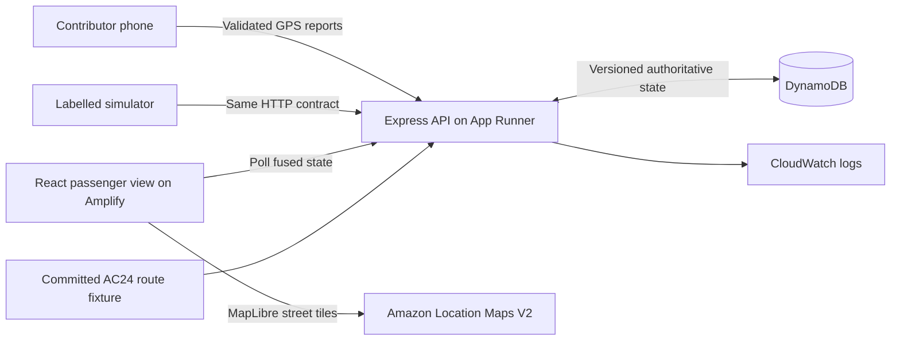

# Main build brief

This is the product build brief, not a completion report. The application already exists here; read [implementation context](docs/IMPLEMENTATION_CONTEXT.md) and [PROGRESS.md](PROGRESS.md) before continuing.

## Objective

Build **BusKothay**, a basic but complete transport website for **AC24, Patuli → Howrah**, that a small team can understand and deploy. A passenger opens the website and immediately sees a useful map and arrival information. A driver starts a journey, other contributors join it, and several phones produce one journey position. During missing GPS, the UI gives a bounded estimate and then admits that the location is stale.

Use [AGENTS.md](AGENTS.md) as the persistent instruction file. Use [IMPLEMENTATION_PLAN.md](IMPLEMENTATION_PLAN.md) as background, with the explicit corrections in [DECISIONS.md](docs/DECISIONS.md).

This is an application, not a visual prototype. Finish real data flow before decorative polish. Keep the code conventional and editable by people.

## Required first release

1. Passenger route page at `/r/:routeId`; `/` opens the configured default route.
2. Interactive map with real tiles, road-following route geometry, selectable stops, bus marker, and a visible attribution control.
3. Stop list with distance, arrival ranges, schedule when available, and trustworthy freshness labels.
4. Contributor page at `/drive`: create journey, share join code/link, join, consent to GPS, share position, stop sharing, and driver-only end journey.
5. Protected diagnostics at `/ops/:journeyId`: source counts, accepted/rejected reports, reasons, weights, and state changes.
6. Backend handling real phone and simulator reports through the same validated API.
7. One-dimensional route fusion, disagreement rejection, bounded prediction, recovery, and basic deterministic ETA.
8. Local in-memory mode and a tested DynamoDB adapter for AWS. Both follow the same behaviour contract.
9. Simulator that starts its own labelled demo journey, adds multiple sources, injects outages, and prints measured results.
10. A reproducible npm workspace, lockfile, environment examples, Docker image, CI checks, Amplify configuration, and documented AWS setup.

Do not cut the real map, real API connection, mobile usability, or honest state handling to add extra features.

## Deferred work

Accounts, OTP, payment, chat, WhatsApp/SMS, native apps, ML, multiple cities, route CRUD, background web location promises, dark mode, advanced analytics, journey replay, and a multi-bus comparison interface are outside the first release.

Keep the backend journey model independent enough to support two journeys and test their isolation. A sophisticated multi-bus UI is not required. Live traffic refresh, a CloudWatch dashboard, and advanced diversion recovery come after the required release; the app must work without them.

## Stack and repository layout

Use npm workspaces without Nx/Turborepo. Use a supported compatible set of stable package versions, record the selected versions, and commit `package-lock.json`. Node 24 LTS is the runtime baseline; do not copy Node 20 from the old plan.

```text
/
  AGENTS.md
  INSTRUCTIONS.md
  IMPLEMENTATION_PLAN.md
  README.md
  CONTRIBUTING.md
  package.json
  package-lock.json
  .nvmrc
  .gitignore
  .dockerignore
  .editorconfig
  tsconfig.base.json
  Dockerfile
  compose.yaml
  amplify.yml
  .github/workflows/ci.yml
  apps/
    api/
      .env.example
      src/
        app.ts
        server.ts
        config.ts
        routes/
        auth/
        fusion/
        store/
        observability/
      test/
    web/
      .env.example
      src/
        app/
        pages/
        components/
        features/map/
        features/journeys/
        features/contribution/
        features/ops/
        hooks/
        lib/api.ts
        config/site.ts
        content/en.ts
        styles/tokens.css
        styles/global.css
      public/
      e2e/
    simulator/
      src/
      scenarios/
  packages/
    shared/src/          # schemas, DTOs, units, thresholds, bounded projection
    geometry/src/        # pure projection/interpolation; no React or AWS
  data/routes/
  scripts/
  infra/
  docs/
```

The tree is a target to implement, not a claim that these files already exist. Small equivalent naming changes are allowed only if documentation is updated. Do not duplicate route JSON under several apps.

Use package names `@buskothay/api`, `@buskothay/web`, `@buskothay/simulator`, `@buskothay/shared`, and `@buskothay/geometry`. Shared packages must build before their consumers; verify package exports resolve in compiled Node and Vite, not only the editor.



## Root commands to implement

| Command | Required behaviour |
| --- | --- |
| `npm ci` | Clean reproducible installation from the committed lockfile |
| `npm run dev` | Build/watch shared packages and run API + web; shut both down cleanly |
| `npm run build` | Build shared packages, API, web, and simulator in dependency order |
| `npm run lint` | Lint all source packages |
| `npm run typecheck` | Type-check every workspace |
| `npm test` | Deterministic unit and API integration tests; no AWS account required |
| `npm run test:e2e` | Browser tests with a real local API and seeded demo data |
| `npm run routes:validate` | Validate geometry, stops, distances, timetable, and attribution |
| `npm run simulate -- --scenario happy-multi --api http://localhost:3001` | Start a scenario through the API and report its actual result |
| `npm run check` | Lint, type checks, route validation, tests, and production build |

Document browser-install prerequisites for E2E tests. Avoid shell syntax that only works on one teammate's machine; use small Node scripts when orchestration needs portability.

## Build order and completion gates

### 1. Establish a reproducible skeleton

Inspect the existing workspace and preserve user edits. Create the workspace, shared schemas, environment validation, route fixture, API health endpoint, and web shell. Verify a clean install and production build.

Resolve an actual road-following AC24 fixture with recorded provenance, using [the route brief](docs/ROUTE_AND_CONTENT.md). The user has selected Patuli → Howrah; verify exact checkpoint locations and geometry. Mark approximate geometry explicitly. Do not invent a timetable or claim operator integration. The route fixture must work without calling AWS at every boot.

### 2. Complete one real vertical path

Implement create journey → authenticated location report → state read → map marker. Use the simulator to drive this path over HTTP. Implement loading and empty states now. A temporary fixture may help development, but remove hidden production fixture switches before completing this gate.

### 3. Add mobile contributors and honest tracking

Implement join codes, GPS consent, batching, rejection feedback, stop sharing, multiple sources, bounded outage projection, and recovery. Both client and server must use the shared projection rules. Add the corresponding behaviour tests as logic is introduced.

### 4. Finish the product surfaces

Apply the design system, stop selection, ETA ranges, route details, protected ops page, and all error states. Test the actual map on mobile and desktop sizes. Confirm no action is a placeholder.

### 5. Add durable cloud behaviour

Implement and test versioned DynamoDB state writes, lifecycle persistence, raw-log retention, CORS, safe logs, and container startup. Build the image from the repository root. Add Amplify configuration and a concrete deployment runbook.

### 6. Verify and hand over

Run the acceptance checks, inspect the UI, and document results. If AWS access is available and deployment is requested, deploy and perform public HTTPS smoke tests. Otherwise deliver a locally verified application and precise remaining cloud setup, with no fake live URL.

Update README, manual editing, and contribution instructions so a teammate can clone and work without asking the original AI how it works.

## Definition of done

The acceptance checklist in [TESTING_AND_ACCEPTANCE.md](docs/TESTING_AND_ACCEPTANCE.md) is the source of truth. Do not call a frontend-only mock, an unbuilt Dockerfile, or a deployment guide without a tested application complete.
