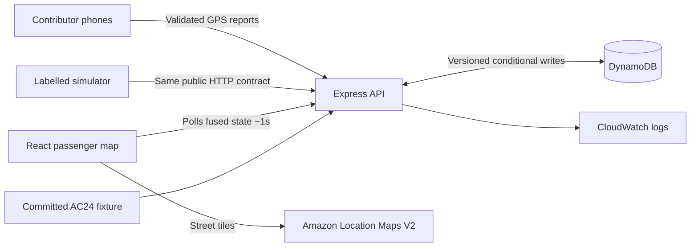

# BusKothay

Community bus tracking for **AC24, Patuli → Howrah** in Kolkata. A passenger
opens the site and immediately sees where the bus is, when it should reach their
stop, and — this is the part most trackers skip — how much that answer can be
trusted right now.

People on the bus share their phone's location. Several phones become one
journey position. When the locations stop arriving, the app keeps answering for
about ninety seconds within honest bounds, and then says plainly that it no
longer knows.

**Status: working locally, not deployed.** See
[What has actually been verified](#what-has-actually-been-verified) below — it
distinguishes what was run from what was only written.

---

## Quick start

Node 24 (the version in `.nvmrc`) and npm 10.9 or newer.

```bash
npm ci
cp apps/api/.env.example apps/api/.env
cp apps/web/.env.example apps/web/.env.local
npm run dev
```

The API listens on <http://localhost:3001> and the web app on
<http://localhost:5173>. The map shows the AC24 route and a clear "no bus is
sharing its location right now" — because none is yet.

On Windows, replace the two copy lines with:

```powershell
Copy-Item apps\api\.env.example apps\api\.env
Copy-Item apps\web\.env.example apps\web\.env.local
```

In a second terminal, put a labelled demonstration bus on the map:

```bash
npm run simulate -- --scenario happy-multi --api http://localhost:3001
```

That drives a real journey through the ordinary public API — create, join,
report, read, end — with four simulated phones at plausible speeds and plausible
noise. It runs for sixty seconds at real speed, because a simulator cannot
honestly accelerate a server's clock.

To see the contributor side, open <http://localhost:5173/drive>, press **Start a
journey**, and then **Start sharing my location**. Nothing asks for your location
until you press that button.

## Commands

| Command | What it does |
| --- | --- |
| `npm ci` | Clean install from the committed lockfile |
| `npm run dev` | Build shared packages, run API + web, shut both down on Ctrl-C |
| `npm run build` | Build everything in dependency order. Needs no cloud settings |
| `npm run build:deploy` | The guarded build Amplify and CI run. Refuses a web bundle that points at localhost or ships without a map key |
| `npm run lint` | Lint every source package |
| `npm run typecheck` | Type-check every workspace |
| `npm test` | Unit and API tests. Deterministic, no AWS, no network |
| `npm run test:e2e` | Browser journeys against a real API and a real static build |
| `npm run routes:validate` | Validate route geometry, stops, distances and provenance |
| `npm run simulate -- --scenario <name> --api <url>` | Run one scenario, or `all` |
| `npm run screenshots` | Capture the review screenshots at four widths |
| `npm run dynamodb:init` | Create the table in DynamoDB Local |
| `npm run check` | Lint, types, route validation, tests, production build |

`npm run test:e2e` needs a browser runtime once per machine:

```bash
npx playwright install --with-deps chromium
```

If your machine already has a Chromium build, set `CHROMIUM_PATH` to it instead.

## How it works



Four ideas carry most of the design:

**Fuse distance along the route, not latitude and longitude.** Every incoming fix
is projected onto the committed AC24 polyline, which turns a two-dimensional
problem into a one-dimensional one, keeps the marker exactly on the road, and
makes "has it passed my stop?" a comparison rather than a guess.

**Consensus before accuracy weighting.** A phone claiming five-metre accuracy has
not proved anything. With three or more sources the majority cluster is found
first with an unweighted median and a MAD filter; only then are the survivors
weighted, and no single source may carry more than 45% of the answer. Phone
identities are not verified, so nothing here resists a coordinated group of fake
contributors, and nothing claims to.

**One bounded projection, shared.** The server computes the passenger's position
at read time and the browser advances the marker between polls using the *same*
function and the *same* anchor, complete with its cap and its stale deadline.
That is why the dot cannot walk down the route forever when the network drops.

**State is authoritative in the database, not in memory.** Instance memory is a
cache. Every mutation reads the snapshot, applies a pure transition, and writes
it back conditionally on a version; a conflict means recompute, not overwrite.

### Repository layout

```text
apps/api/        Express API: ingestion, fusion, authoritative state
  src/fusion/      Pure engine — gates, consensus, Kalman filter, ETA, transitions
  src/store/       One repository interface; memory and DynamoDB adapters
  src/auth/        Capabilities, hashing, join codes
  src/routes/      HTTP validation and response mapping
  src/service/     Use cases between the handlers and the engine
apps/web/        React + Vite + MapLibre: passenger map, /drive, /ops
apps/simulator/  CLI that drives demo journeys through the public API
packages/shared/ The one contract: Zod schemas, constants, bounded projection
packages/geometry/ Pure route geometry — projection, interpolation, distances
data/routes/     The committed AC24 fixture
infra/           CloudFormation templates and the deployment runbook
docs/            The build specification this repository was written against
```

`apps/api/src/service/` is the one addition to the layout in `INSTRUCTIONS.md`:
business rules live there rather than inside route handlers.

## The AC24 route

The route **identity** — code, origin, destination, and the corridor through
Ruby, Gariahat, Hazra, Exide, Park Street and Esplanade — comes from WBTC's
published route list, retrieved on 2026-09-18.

The **coordinates do not**. The machine that built this repository had no network
route to any routing provider, so the corridor was placed by hand, accurate to
roughly the width of a city block. It has not been checked against the
carriageway the bus actually uses, the correct side of a divided road, or
surveyed boarding points. The fixture is marked `isApproximateGeometry: true`,
and every screen that shows the route says so.

To replace it with a real road trace:

```bash
node scripts/fetch-route-geometry.mjs --route ac24-patuli-howrah --provider amazon --region ap-south-1
# then look at the line on a street map, bump `version`, and re-run:
npm run routes:validate
```

The script will not set `isApproximateGeometry` to false for you, because it
cannot look at a map.

There is **no timetable**. No departure times, fares, durations or operator feed
have been supplied, so `schedule` is null, `delaySeconds` is always null, and the
UI says "Schedule unavailable" rather than "On time". Arrival times come only
from people sharing their location, and are labelled approximate.

AC-24A is a different service that starts at Kamalgazi. It is not this route.

## Honesty rules the code enforces

These are not style preferences; they are tested.

- A predicted position never marks a stop passed. Of a passenger's questions,
  "has it already gone?" is the one where a wrong answer costs the most.
- Unknown position is `null`, not `[0, 0]`. Unknown arrival is `null`, not zero
  minutes.
- `STALE` means the estimate is frozen. The UI says **Last confirmed … ago** and
  withdraws the arrival time rather than leaving a tempting number on screen.
- A simulated journey is labelled **Demo** everywhere it appears.
- Public payloads carry the fused journey only: no contributor IDs, no raw
  positions, no capabilities, no hashes.
- The published confidence is called **approximate accuracy**, never a
  probability. The simulator measures how often the real error actually falls
  inside it, and prints that number whether or not it is flattering.

## Privacy

There are no accounts. A contributor gets a random ID for one journey, and
holding a capability is the whole of the authorisation model. Sharing stops the
moment someone presses stop, and their capability is revoked. Individual reports
leave application access after 48 hours; the underlying deletion happens
asynchronously afterwards, so this is not instant erasure and the interface does
not claim it is. These are opt-in pseudonymous reports, not anonymous data.

Capabilities travel in an `Authorization` header and never in a URL — a link gets
pasted into chats, appears in screenshots, and ends up in server logs.

## What has actually been verified

Run on Node 24.21.0 in a Linux container, against a real local API.

| Check | Result |
| --- | --- |
| `npm ci` from the committed lockfile | passes |
| `npm run dev` | starts the API and the web app, and confirms the API is responding |
| `npm run lint` | passes, no warnings |
| `npm run typecheck` | passes |
| `npm run routes:validate` | passes; AC24 measures 17.39 km with ordered checkpoints |
| `npm test` — 91 tests | passes |
| `npm run test:e2e` — 40 tests, mobile and desktop | passes |
| `npm run build` | passes |
| Screenshots at 390, 768, 1440 and 320 px | captured; no horizontal overflow at any width |
| Production dependency layout (compiled output + `npm ci --omit=dev` only) | starts and serves the route, so the container's runtime layout resolves `@buskothay/shared` |
| Simulator: `happy-multi`, `all-drop-30s`, `all-drop-180s`, `bad-accuracy` | pass. Live error p50 9 m / p95 16 m; 30 s blackout max error 6 m; recovery 1.1 s; spoofed and unusable reports 100% refused |

The other nine scenarios in the library **have not been run** — the full set takes
about fifteen minutes of real time. `PROGRESS.md` lists which, and what covers
them in the meantime.

**Not verified, and not claimed:**

- **No deployment exists.** No AWS resources have been created. The templates in
  `infra/` and the runbook have been written and reviewed, not applied.
- **The Docker image has not been built.** The build environment had no Docker
  daemon. The Dockerfile is written to build from the repository root and the
  production dependency layout was checked separately, but nobody has run
  `docker build` on it yet. Do that before trusting it.
- **No physical device testing.** The browser tests emulate geolocation and say
  so. Nobody has stood on an AC24 bus with a phone.
- **The route geometry is approximate**, as described above.
- **The production basemap has not been seen.** Development uses the MapLibre
  demonstration style, and the browser tests use a basemap-free fixture so they
  do not depend on a tile server. Amazon Location tiles need a real key and a
  look in the network panel before anyone calls the map integration done.

## Working on it

- [CONTRIBUTING.md](CONTRIBUTING.md) — branches, pull requests, who owns what
- [docs/MANUAL_EDITING.md](docs/MANUAL_EDITING.md) — where to change the name,
  colours, stops, thresholds and copy
- [infra/RUNBOOK.md](infra/RUNBOOK.md) — the AWS deployment steps, in order
- [PROGRESS.md](PROGRESS.md) — build state and handover notes

The build specification this repository was written against is in
[AGENTS.md](AGENTS.md), [INSTRUCTIONS.md](INSTRUCTIONS.md) and [docs/](docs/).
`docs/DECISIONS.md` corrects parts of `IMPLEMENTATION_PLAN.md` and wins wherever
the two disagree.
